# 🚗 WRO 2026 Future Engineers — Team Glitch

<div align="center">

[](https://www.youtube.com/@TeamGlitchWRO)

</div>

---

## 🏆 WRO 2026 Future Engineers — India Nationals

Welcome to the GitHub repository of **Team Glitch**, competing in the **World Robot Olympiad™ (WRO®) Future Engineers 2026** category at the India National Finals. Our team is made up of students who designed, built, and programmed a fully autonomous self-driving vehicle to tackle the dynamic challenges of the WRO 2026 competition.

Our name, **Glitch**, reflects our engineering philosophy — finding the unexpected edge cases, the subtle bugs, and the tiny mis-alignments that make the difference between a run that scores and a run that doesn't. We don't just build a robot; we debug it relentlessly until every glitch is gone.

> *"Every test run is a debugging session. Every crash is data."*

**Current best times on the 3m × 3m field:**
- **Open Challenge**: ~50 seconds (full score)
- **Obstacle Challenge**: ~72 seconds (full score)

**PLACEHOLDER: Team banner image**

---

## 📚 Table of Contents

- [📂 Documentation Structure](#-documentation-structure)
- [👥 The Team](#-the-team)
- [🎯 Challenge Overview](#-challenge-overview)
- [🤖 Our Robot](#-our-robot)
- [🔧 Electronic Systems & Components](#-electronic-systems--components)
- [⚙️ Mechanical Systems](#️-mechanical-systems)
- [💻 Software Architecture](#-software-architecture)
- [🧭 Open Challenge — Strategy & Logic](#-open-challenge--strategy--logic)
- [🚧 Obstacle Challenge — Strategy & Logic](#-obstacle-challenge--strategy--logic)
- [🔄 Engineering Decisions & Iterations](#-engineering-decisions--iterations)
- [📹 Performance Videos](#-performance-videos)
- [🌐 GitHub Utilization](#-github-utilization)
- [📜 License](#-license)

---

## 📂 Documentation Structure

Each folder in this repository contains detailed technical content:

| Folder | Content | 
|--------|---------|
| `v-photos/` | Robot photos — 6 angles + labelled component view |
| `t-photos/` | Team photos — official and fun |
| `schemes/` | Wiring diagram, power architecture |
| `models/` | 3D print STL files, STEP CAD files for polycarbonate cuts |
| `src/` | Main Python scripts — obstacle and open challenge |
| `versionTest/` | Test Python scripts — All modules testing|
| `other/` | Component images used in this README |

---

## 👥 The Team

**Official Team Photo**

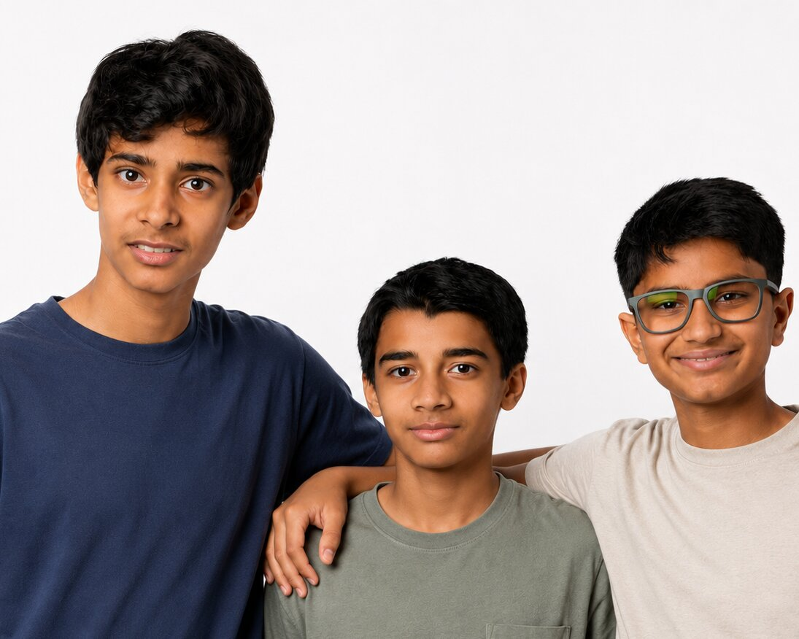

---

| Member | Role | Background | About |
|--------|------|------------|--------|
| **Shaurya Sule** | Documentation, Electronics, Strategy | 9th Grade | Shaurya is a Grade 9 student at Dhirubhai Ambani International School with a strong interest in robotics and debate. He has participated in WRO multiple times, including competing at the World Championships and achieving 3rd place. He is also the captain of his FTC team, where he develops leadership, engineering, and problem solving skills. Alongside robotics, he is an accomplished debater and has won multiple debate championships across India.|
| **Rehaan Dhandhia** | Software, Vision & Sensor Integration | 9th Grade | Rehaan is a Grade 9 student at Dhirubhai Ambani International School. He has participated in WRO for four years and achieved 3rd place at the WRO World Finals in 2023. He has also been involved in FIRST Tech Challenge (FTC) for the past two years. Through robotics, he has developed skills in programming, electronics, and problem solving. Outside robotics, he enjoys mathematics and physics, has played the piano for eight years, and has competed in state level badminton tournaments.|
| **Zeus Wadia** | Electronics, Testing, Mechanical Design | 9th Grade | Zeus is a Grade 9 student at Nita Mukesh Ambani Junior School, Mumbai, with a strong interest in robotics and engineering. He has competed in WRO and FTC, gaining experience in robot design, electronics, programming, and autonomous systems. In 2025, he placed 12th at the WRO Future Innovators Junior National Finals and has participated in FTC for the past two years.|

**Coach:** **Ajinkya Giri** — Robotics Engineer and Mentor

**Fun Team Photo:**
This photo is from the 2025 WRO India nationals, where the 3 of us competed as a team in the Future Innovators category and eventually placed 12th.
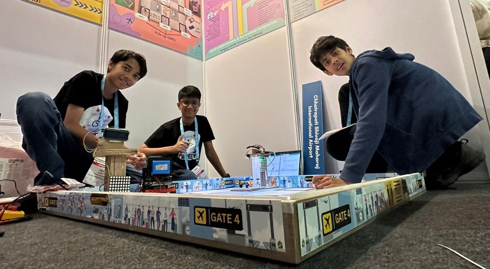

### Team Journey

Throughout development — from first chassis cut to nationals — we logged every run, debugged every crash, and iterated on every subsystem. The photos below capture key moments from that process.

**Testing session photo:** Tuning robot parking (setting up obstacle challenge).

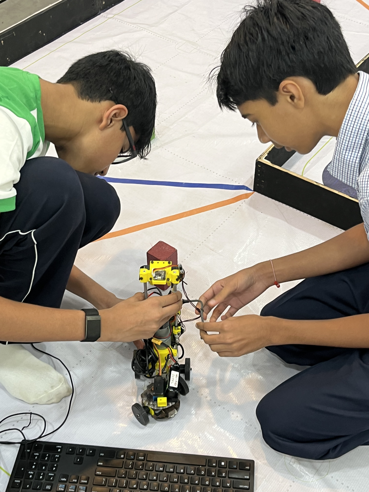

---

## 🎯 Challenge Overview

WRO 2026 Future Engineers is a self-driving car challenge on a 3m × 3m racetrack that changes configuration every round.

### Open Challenge

| Aspect | Requirement | Our Approach |
|--------|-------------|--------------|
| **Track Variability** | Random internal wall placements | Outer wall centroid PD — adapts to any corridor width |
| **Navigation** | Unknown layout each round | Camera wall detection + IMU heading hold |
| **Lap Count** | 3 laps, stop at start | Counter + `last_wall` camera zone + IMU heading snap |
| **Speed** | Sub-60s target | 85% PWM, smoothed ramp, no speed PID needed |

### Obstacle Challenge

| Aspect | Requirement | Our Approach |
|--------|-------------|--------------|
| **Traffic Signs** | Red → right, Green → left | OpenCV HSV centroid PD, 2-state avoidance |
| **Lap Count** | 3 laps | Floor line colour trigger, encoder odometry |
| **Parking** | Fully inside lot, parallel to wall | 4-state parking state machine + TFmini Plus proximity |
| **Direction** | Detected at start | Side wall distance + outer wall camera zone |

### WRO 2026 Documentation Scoring (30 Points)

| Area | Max Points | Our Coverage |
|------|------:|------|
| **1. Mobility & Mechanical Design** | 6 | Motor selection, Parallel steering system, custom polycarbonate chassis, drive system, encoder integration |
| **2. Power & Sensor Architecture** | 6 | Dual rail power system, TFmini Plus LiDAR, BNO085 IMU, sensor placement, wiring diagrams |
| **3. Software Architecture & Obstacle Strategy** | 6 | State machines, HSV vision pipeline, centroid based PD control, obstacle avoidance logic, parking sequence, source code |
| **4. Systems Thinking & Engineering Decisions** | 6 | Design iterations, subsystem integration, engineering tradeoffs, decision rationale, risk mitigation |
| **5. Reproducibility & GitHub Quality** | 6 | Structured repository, commit history, README, CAD files, wiring diagrams, full documentation, replication guide |
| **Total** | **30** | |

### Educational Objectives

- **Computer Vision**: Real-world HSV colour segmentation, zone-based detection, LAB colour space
- **Control Systems**: PID steering, closed-loop speed control, positional vs. incremental PID
- **Embedded Systems**: Multiprocessing on Linux, UART communication, I2C sensor management
- **Systems Engineering**: Process isolation, shared memory, fault recovery
- **Engineering Documentation**: Decision rationale, iteration history, replication guides

---

## 🤖 Our Robot

<div align="center">

<table>
  <tr>
    <td align="center"><b>Front View</b></td>
    <td align="center"><b>Rear View</b></td>
  </tr>
  <tr>
    <td>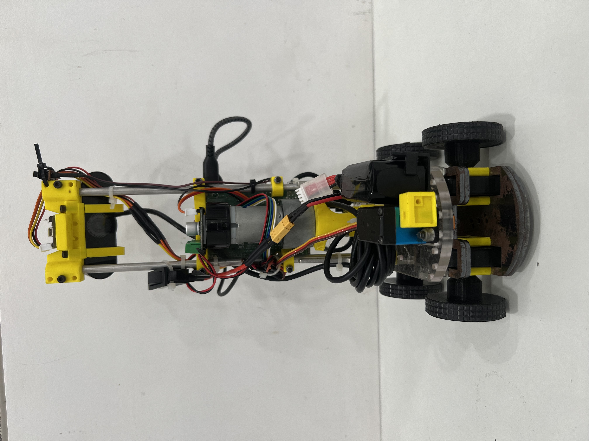</td>
    <td>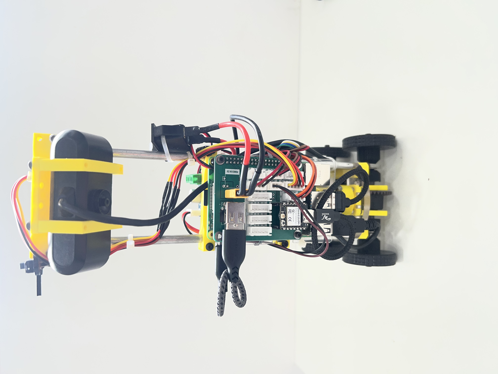</td>
  </tr>
  <tr>
    <td align="center"><b>Left Side</b></td>
    <td align="center"><b>Right Side</b></td>
  </tr>
  <tr>
    <td>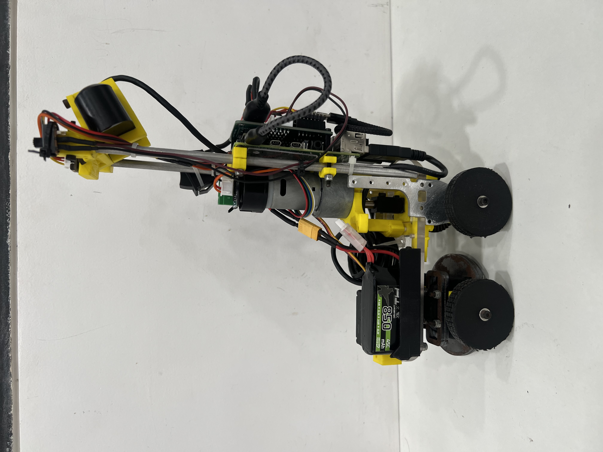</td>
    <td></td>
  </tr>
  <tr>
    <td align="center"><b>Top View</b></td>
    <td align="center"><b>Bottom View</b></td>
  </tr>
  <tr>
    <td>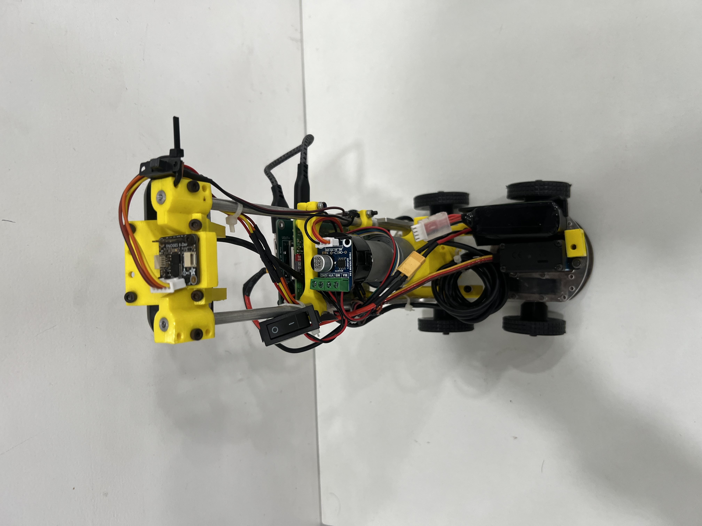</td>
    <td></td>
  </tr>
  <tr>
    <td colspan="2" align="center"><b>Labelled Component View</b></td>
  </tr>
  <tr>
    <td colspan="2" align="center"></td>
  </tr>
</table>

</div>

### Key Specifications

| Parameter | Value |
|-----------|-------|
| **Dimensions** | [190] × [120] × [300] mm |
| **Weight** | ~[1.310] kg |
| **Drive Type** | Rear-wheel drive, 12V DC geared motor + external quadrature encoder |
| **Steering** | Servo-actuated parallel steering system |
| **Primary Brain** | Raspberry Pi 4 Model B (4 GB) |
| **Co-processor** | Seeed XIAO ESP32-C3 (IMU + encoder over USB UART) |
| **Vision** | USB Camera + OpenCV HSV pipeline (no Edge TPU) |
| **Distance Sensor** | 1× TFmini Plus LiDAR (right side, UART, parking only) |
| **Heading** | Adafruit BNO085 9-DOF IMU (on XIAO, I2C) |
| **Max Speed** | ~90% PWM duty cycle |

### Performance Specifications

| Metric | Value |
|--------|-------|
| **Max theoretical speed** | ~[2] m/s (from 900RPM + wheel diameter) |
| **Operational speed** | ~[2.703] m/s (90% PWM, closed-loop) |
| **Battery capacity** | [850] mAh LiPo |
| **Camera FPS (live loop)** | ~25 FPS (with `cv2.imshow` disabled) |
| **IMU update rate** | 100Hz (BNO085 Euler output) |
| **UART baud rate** | 115200 (XIAO → Pi) |

---

## 🔧 Electronic Systems & Components

### Component List

| Component | Image | Specifications | Role | Source |
|-----------|-------|---------------|------|--------|
| **Raspberry Pi 4 Model B (4GB)** | 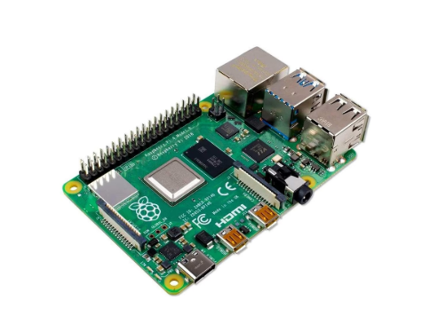 | Quad-core Cortex-A72 @ 1.8GHz, 4 GB LPDDR4, USB 3.0, GPIO 40-pin | Main compute — vision, sensor fusion, PID control via pigpio | [robu.in](https://robu.in/product/raspberry-pi-4-model-b-with-4-gb-ram/) |
| **Seeed XIAO ESP32-C3** | 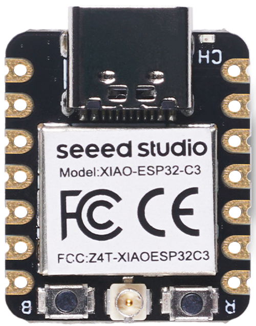 | ESP32-C3 RISC-V @160MHz, 400KB SRAM, USB-C, 3.3V logic, 21×17.5mm | Co-processor — BNO085 IMU + external encoder, streams to Pi at 115200 baud | [robu.in](https://robu.in/product/seeed-studio-xiao-esp32c3/) |
| **Benewake TFmini Plus LiDAR ×1** | 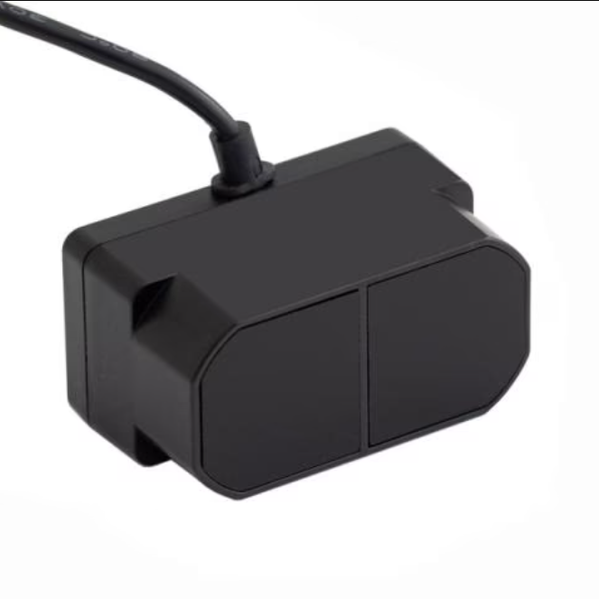 | 0.1–12m, ±5cm accuracy, 3.6° FOV, UART 115200, 5V, IP65, 42×15×16mm | Right-side parking proximity — when `distance < 150mm` parking approach confirmed | [robu.in](https://robu.in/product/tfmini-plus-lidar-distance-sensor-for-drones-uav-uas-robots-12m/) |
| **Adafruit BNO085 IMU** | 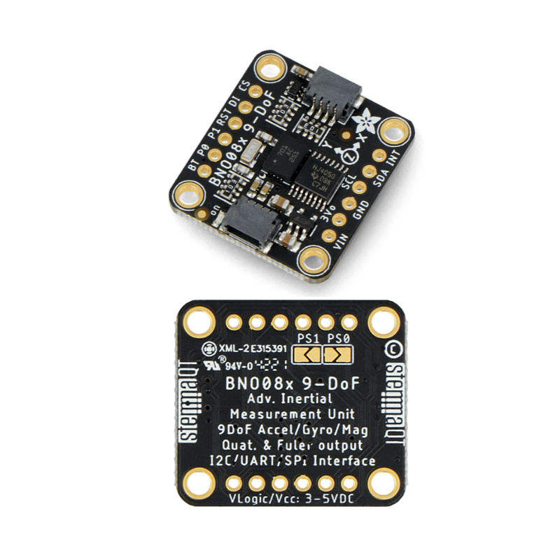 | 9-DOF, ARM Cortex-M0 fusion, Euler @100Hz, I2C | Absolute heading for PID steering — prevents drift across all 3 laps | [evelta.com](https://evelta.com/adafruit-bno085-9-dof-orientation-imu-fusion-breakout/) |
| **USB Camera** | 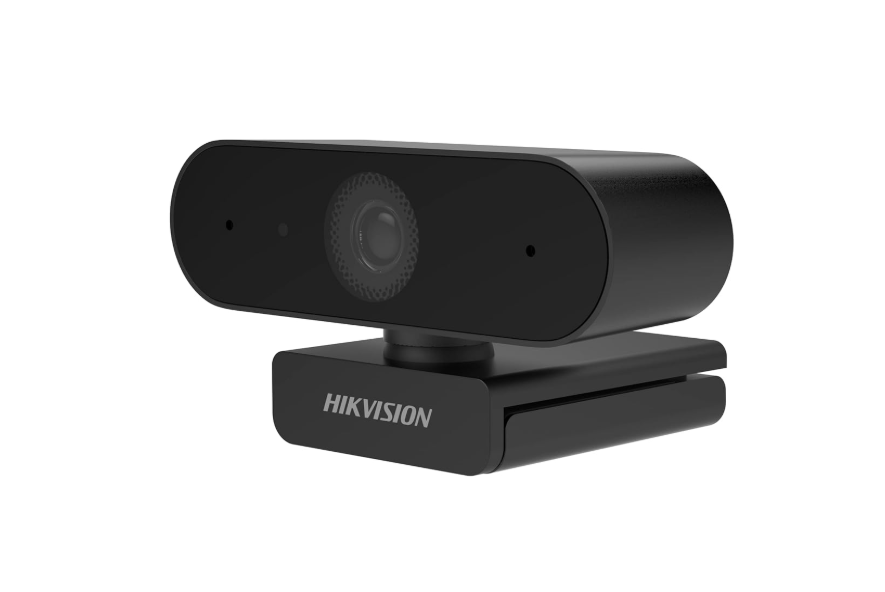 | 2MP, 1080P @ 30fps, ultra-wide, USB 2.0 | HSV pipeline input — detects pillars, parking markers, floor lines, walls | [amazon.in](https://www.amazon.in/HIKVISION-DS-U02-Distortion-Adjustment-Conferencing/dp/B0929FSQ2J) |
| **Johnson 900RPM Grade A** (RKI-1142) | 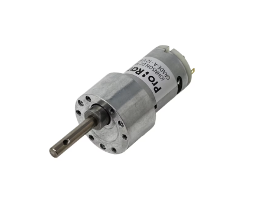 | 12V DC, 900RPM no-load, high-torque grade-A gearbox, no built-in encoder | Rear-wheel drive via Vikram-453R6. External encoder on output shaft | [robokits.co.in](https://robokits.co.in/motors/dc-motor/12v-johnson-motors/johnson-geared-dc-motors/johnson-motor-high-torque-dc-geared-12v-900rpm-grade-a) |
| **7Semi Vikram-453R6** | 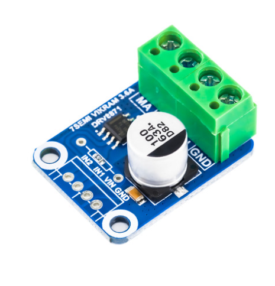 | DRV8871, 6.5–45V, 2A cont / 3.6A peak, IN1/IN2 PWM, thermal protection | Motor driver — IN1=GPIO16, IN2=GPIO20. Auto-recovery on overcurrent | [7semi.com](https://7semi.com/7semi-vikram-453r6-dc-motor-driver-breakout-6-5v-45v-input-3-6a-single-channel/) |

**Component Selection Philosophy:** We prioritize components that are widely available in India, well-documented, and separable by concern — the Pi handles vision and decisions, the XIAO handles timing-critical encoder counting, and the TFmini Plus handles parking proximity without sharing the I2C bus. Every component was chosen because it solves a specific, tested problem.

### Power Architecture

The robot uses a **dual-rail power system** — motor on 12V direct, all electronics on regulated 5V. This was non-negotiable after early testing showed motor PWM spikes causing 40°+ BNO085 heading jumps on a single-rail setup.

```
[12V LiPo Battery]
       |
       ├── [Vikram-453R6 (IN1=GPIO16, IN2=GPIO20)] ──> Johnson 900RPM Motor
       |
       └── [5V Buck Converter]
                   |
                   ├── Raspberry Pi 4 (5V/3A USB-C)
                   │       └── [Pi UART /dev/ttyAMA1] ──> TFmini Plus right (5V)
                   ├── Servo UBEC (dedicated ≥5A)
                   │       └── DS3235 servo signal → GPIO8
                   └── Seeed XIAO ESP32-C3 (via Pi USB-C)
                           └── [XIAO 3V3 rail] ──> BNO085 IMU (I2C)
                                                    External encoder (GPIO)

[I2C — XIAO only]     XIAO ←→ BNO085 (3.3V)
[UART — Pi ttyAMA1]   TFmini Plus right → Pi
[UART — Pi XIAO_USB]  XIAO → Pi — heading (float) + counts (int)
[USB]                 Camera → Pi /dev/video0
```

**Power budget:**

| Component | Voltage | Current |
|-----------|---------|---------|
| Johnson 900RPM (loaded) | 12V | ~400mA typical, ~2A stall |
| Raspberry Pi 4 | 5V | 1.0–1.5A |
| XIAO ESP32-C3 | 5V via Pi USB | 25–40mA |
| TFmini Plus ×1 | 5V | 110mA avg |
| DS3235 servo | 5–6V UBEC | 5mA idle, ~2A stall |
| **Total peak (referred to 12V)** | — | **~3.0A** |

### Wiring Diagram

<div align="center">
  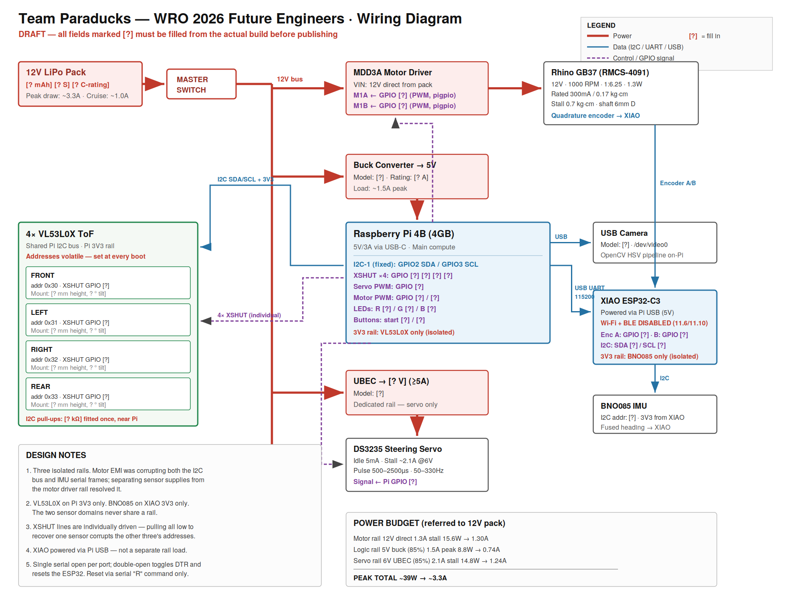
</div>

### GPIO Pin Assignment

| GPIO / Interface | Function | Direction |
|-----------------|----------|-----------|
| GPIO6 | Kill switch input | IN |
| GPIO8 | DS3235 servo PWM | OUT |
| GPIO13 | Red LED | OUT |
| GPIO16 | Vikram IN1 — forward PWM | OUT |
| GPIO19 | XIAO reset | OUT |
| GPIO20 | Vikram IN2 — reverse PWM | OUT |
| GPIO26 | Blue LED | OUT |
| /dev/ttyAMA1 | TFmini Plus right (UART RX) | IN |
| /dev/XIAO_USB | XIAO ESP32-C3 (UART) | IN/OUT |
| /dev/video0 | USB camera | IN |

### Sensor Placement Rationale

**TFmini Plus — Right side (`/dev/ttyAMA1`):** Mounted at 60mm from ground on the right flank, perpendicular to travel. Used only during parking approach. Its 3.6° laser spot reads the outer wall cleanly — the VL53L0X it replaced had a 25° FOV that picked up floor reflections below 80mm. Mounting at 30mm initially caused this problem; 60mm resolved it.

**Camera:** Front-facing, slight downward angle. Exposure fixed at `CAP_PROP_EXPOSURE = -6` — without this, auto-exposure flicker between light/dark mat sections caused false negatives on every orange line crossing.

**BNO085 IMU:** On the XIAO, powered from XIAO 3V3 only, positioned ≥80mm from the Johnson motor and Vikram driver. At 40mm we measured 3° drift per stall event — moving to 80mm eliminated this.

### Power Management — Engineering Note

During early testing we found the Pi's 3V3 rail was insufficient to power the BNO085 cleanly when the motor was under load. The fix was to power the BNO085 exclusively from the XIAO's own 3V3 regulator, which is isolated from the Pi's rail entirely. This is why the XIAO is powered via USB from the Pi (5V) but the BNO085 never touches the Pi's 3V3 pin.

---

## ⚙️ Mechanical Systems

### Chassis Design

<div align="center">
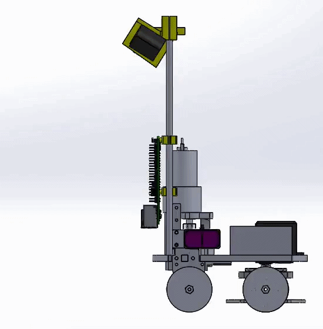
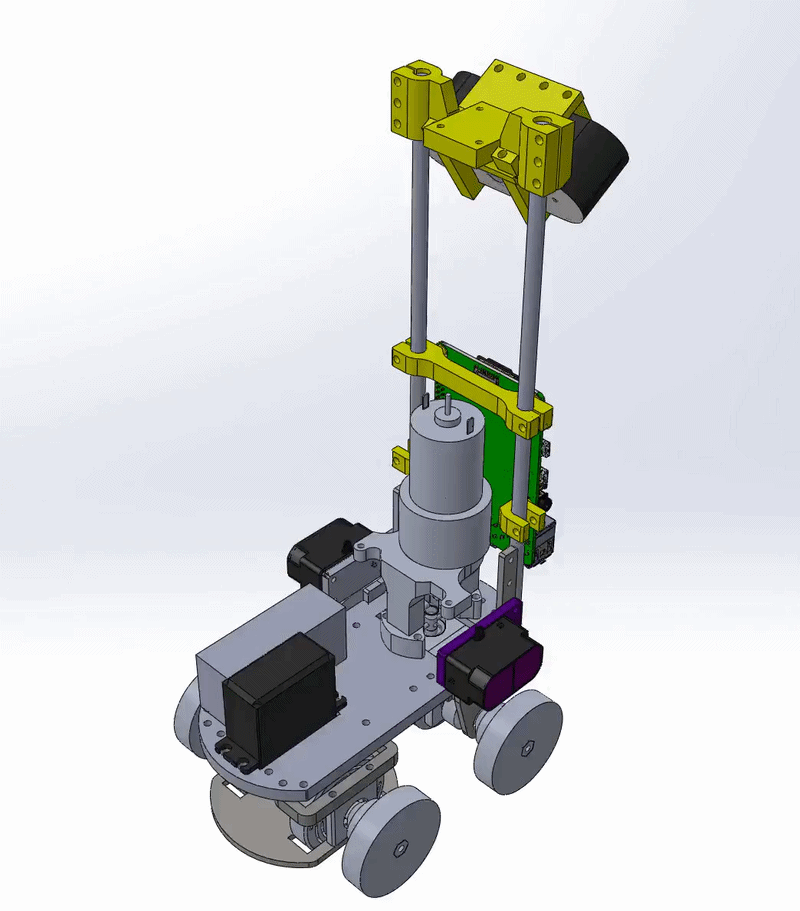
</div>
The chassis and electronics tray are laser-cut or CNC-cut from polycarbonate sheet (6mm chassis, 3mm tray) — not 3D printed. The rear axle is driven by the Johnson 900RPM motor via direct coupling. The front axle using a parallel steering system  actuated by the DS3235 35kg Servo.

**Why Parallel Steering?** We first considered using Ackerman geometry to reduce wheel skid and tyre scrub, however, this system was extremely bulky. Instead, we decided to use a compact, lightweight parallel steering linkage, which helped us make our bot more compact and balanced.

**Acknowledging Trade-Offs:**
A parallel steering linkage makes the inner wheel skid on tight turns because each wheel follows a different radius. However, using custom designed wheels coated with cat-tongue grip tape helped us minimise tyre deformation.

### Drive System

**Motor Selection:**

| Option | RPM | Torque | Verdict |
|--------|-----|--------|---------|
| Johnson 300 RPM | 300 | ~8 kg·cm | Too slow for sub-60s laps |
| Johnson 600 RPM | 600 | 4.5 kg·cm | Prior season — adequate but limited top speed |
| Rhino GB37 1000RPM | 1000 | 0.7 kg·cm | Tested — stalled at low PWM, insufficient torque |
| **Johnson 900RPM Grade A ✓** | **900** | **High** | **Current — best torque/speed balance, external encoder added** |

**Drive train calculation:**

```
Motor speed    = 900 RPM
Wheel diameter = [44] mm

Linear speed = (RPM / 60) × π × D
             = (900 / 60) × π × [44/1000]
             ≈ [2.073] m/s at 100% PWM
```

The Johnson 900RPM has no built-in encoder. An external quadrature encoder is mounted on the output shaft and read by the XIAO ESP32-C3. `SPEED_SCALE` (counts/sec at 100% duty) must be calibrated from run logs before enabling `ki_v` or `kd_v`.

**Motor Driver:** The Vikram-453R6 (DRV8871) replaced the MDD3A after two driver failures — the MDD3A has no overcurrent protection. The DRV8871 adds hardware overcurrent detection, thermal shutdown, and auto-recovery. Its 45V ceiling handles inductive spikes. The IN1/IN2 PWM interface is pin-compatible with MDD3A so no code changes were needed.

**Reducing Tyre Skid: Differential Gearbox:**
Since while turning, both wheels follow a different turning radius, we decided to use a differential gearbox, which allows the wheels to rotate at different speeds while turning, reducing wheel slippage and improving traction. It uses a ring gear, spider gear, and side gears connected to the wheels, allowing the outer wheel to rotate faster and the inner wheel slower during turns while maintaining a constant motor speed.

### Structural Analysis

| Metric | Value |
|--------|-------|
| Chassis material | 6mm polycarbonate (laser/CNC cut) |
| Electronics tray | 3mm polycarbonate |
| Motor mount hardware | M3 bolts |
| Servo mount | Press-fit into servo bay |
| TFmini Plus mount | `tf mini mount horizontal.STL` at 60mm height |
| Camera tilt | Fixed 10° downward (`new camera mount.STL`) |

### Iteration History

<div align="center">
  
</div>

**Version 1 — National 2025:**
- Raspberry Pi + Arduino Mega co-processor
- Google Coral Edge TPU for object detection (TFLite quantized model)
- RPLidar C1 for turn detection
- Johnson 600RPM motor, MDD3A driver
- Problem: Parking unreliable — single-pass approach overshot; LiDAR subprocess complex and slow

**Version 2 — Nationals 2026 (Current):**
- Replaced Arduino Mega + Coral TPU + RPLidar with leaner stack:
  - **XIAO ESP32-C3** — BNO085 IMU + external encoder over USB UART
  - **1× TFmini Plus** (right only) — parking proximity over UART
  - **OpenCV HSV pipeline** — replaces Edge TPU ML model entirely
- Switched to **Johnson 900RPM Grade A** + external encoder
- Switched to **Vikram-453R6** (DRV8871) — overcurrent protection
- Camera FPS improved from ~5 to ~25 by removing `cv2.imshow` from live loop
- Hot-reloadable `gains.json` — change PID gains without restarting

### Potential Future Improvements

- Switch to a motor with a built-in encoder to eliminate the external encoder mount complexity
- Add a rear-facing camera or second TFmini for reverse safety during parking
- Replace polycarbonate tray with a custom PCB carrier for better wire management
- Implement automatic `SPEED_SCALE` calibration from the first run's log file

---

## 💻 Software Architecture

The software runs on the Raspberry Pi 4 using Python's `multiprocessing` module. Four OS processes run concurrently on separate CPU cores, communicating via `multiprocessing.Value` shared memory. This prevents slow camera inference from blocking the time-critical steering loop.

### Process Architecture

```
┌──────────────────────────────────────────────────────┐
│                     Main Process                      │
│          Spawns all child processes, exits            │
└──────┬──────────────┬────────────────┬───────────────┘
       │              │                │              │
┌──────▼──────┐ ┌─────▼──────┐ ┌──────▼──────┐ ┌────▼───────────┐
│CameraProcess│ │IMUandEncoder│ │ TOFProcess  │ │  DriveProcess  │
│  (P)        │ │  (E)        │ │  (T)        │ │  (S) MAIN LOOP │
│ OpenCV HSV  │ │ /dev/XIAO   │ │ spawned but │ │ Reads ALL      │
│ pipeline    │ │ _USB UART   │ │ TFmini read │ │ shared memory  │
│ → red_b     │ │ → head.value│ │ directly in │ │ PID steering   │
│ → green_b   │ │ →counts.val │ │ DriveProcess│ │ Speed PID      │
│ → pink_b    │ │             │ │             │ │ State machine  │
│ → wall_*    │ │             │ │             │ │ Motor + servo  │
└─────────────┘ └─────────────┘ └─────────────┘ └────────────────┘
```

> **Note on TFmini Plus:** The TFmini Plus is instantiated as `TFmini(17, 27, 25, 24)` inside `DriveProcess` and polled directly via `tfmini.getTFminiData()` each loop. It is not routed through `TOFProcess` — `distance_head` is read as `tf_l` directly in the drive loop.

**Why multiprocessing over threading?** Python's GIL prevents threads from running CPU-bound tasks truly in parallel. `multiprocessing` spawns real OS processes — each with its own GIL — so `CameraProcess` (OpenCV) and `IMUandEncoder` (UART reads) run on separate Pi 4 cores simultaneously.

### Shared Variables (cross-process, lock-protected)

| Variable | Type | Written by | Read by | Purpose |
|----------|------|-----------|---------|---------|
| `head` | float | IMUandEncoder | DriveProcess | IMU heading (°) from BNO085 |
| `counts` | int | IMUandEncoder | DriveProcess | Encoder count for odometry + speed PID |
| `red_b` | bool | CameraProcess | DriveProcess | Red pillar visible |
| `green_b` | bool | CameraProcess | DriveProcess | Green pillar visible |
| `pink_b` | bool | CameraProcess | DriveProcess | Magenta parking marker visible |
| `centr_x/y` | float | CameraProcess | DriveProcess | Green pillar centroid |
| `centr_x_red/y_red` | float | CameraProcess | DriveProcess | Red pillar centroid |
| `centr_x_pink/y_pink` | float | CameraProcess | DriveProcess | Pink marker centroid |
| `wall_left/right` | double | CameraProcess | DriveProcess | Inner wall centroid-X |
| `outer_wall_left/right` | double | CameraProcess | DriveProcess | Outer wall centroid-X |
| `close_wall` | double | CameraProcess | DriveProcess | Close wall area — turn/parking |
| `park_wall` | double | CameraProcess | DriveProcess | Parking wall area |
| `last_wall` | double | CameraProcess | DriveProcess | End-wall area — parking trigger + open stop |
| `orange_l / blue_l` | bool | CameraProcess | DriveProcess | Floor line colour — lap direction |
| `switch_state` | bool | DriveProcess | CameraProcess | Kill-switch state |

### XIAO UART Protocol

The XIAO ESP32-C3 firmware streams sensor data to the Pi at 115200 baud:

**Output format (every loop):**
```
<heading_float> <encoder_int>\n
Example: 91.34 2841
```

**Commands accepted from Pi:**

| Command | Effect |
|---------|--------|
| `b"R"` | Software reset — reboots XIAO and reinitialises BNO085 |
| `b"1"` | Zero the encoder count |

### PID Steering Control (`correctAngle`)

```python
error_gyro = heading - setPoint_gyro
if error_gyro > 180:
    error_gyro -= 360           # handle wraparound

pTerm = kp * error_gyro * multiplier   # kp = 0.6
dTerm = kd * ((error_gyro - prevErrorGyro) / dt)  # kd = 0.01
correction = pTerm + dTerm
correction = max(-25, min(25, correction))

servo.setAngle(95 - correction)   # 95° = mechanical centre (obstacle)
                                  # 90° = mechanical centre (open)
```

`multiplier` values: `1.0` = straight-line hold, `1.5` = normal driving, `3.0` = tight parking turns. `correctReverseAngle` uses `95 + correction` for reverse maneuvers.

### Obstacle Avoidance — Centroid PD

```python
# Target centroid X positions for each colour + state
if green_b.value:
    err = 340 - centr_x          # state 1 (far)
    err = 520 - centr_x          # state 2 (close, centr_y > 100)
    # blue direction + wall visible: 320 / 470
elif red_b.value:
    err = 300 - centr_x_red      # state 1
    err = 120 - centr_x_red      # state 2
    # orange direction + wall visible: 320 / 170

servo_angle = err * kp_s + ((err - prev_err) / dt_main) * kd_s
servo_angle = max(-30, min(30, servo_angle))
servo.setAngle(95 - servo_angle)
```

State 2 lasts 0.08s then resets to state 1, or resets early when `centr_y_pink > 100` or `close_wall > 50`. When no block is visible and one inner wall is detected, a fixed `±15` err nudge centers the robot. When outer walls are visible without blocks, heading is corrected by `heading_angle ± 5°`.

### Speed PID (`correctSpeed`)

Positional PID — output recomputed fresh each call, not accumulated:

```python
actual_cps = raw_delta / dt           # encoder counts per second
target_cps = target_power_pct * SPEED_SCALE / 100.0
error = target_cps - actual_cps

total_error_speed += error * dt
total_error_speed = max(-500, min(500, total_error_speed))   # anti-windup

correction = kp_v * error + ki_v * total_error_speed + kd_v * (error - prev_error) / dt
duty = target_power_pct + correction   # baseline + correction — NOT accumulated
duty = max(0.0, min(100.0, duty))
```

Auto-resets on direction flip. `SPEED_SCALE` must be calibrated from run logs — the default in `gains.json` is `0.0` as a reminder.

### Vision Pipeline

`CameraProcess` runs either `vision_pipeline_new.py` (obstacle) or `vision_pipeline_3.py` (open). Both are pure OpenCV — no ML accelerator.

**Pipeline steps:**
1. Capture frame via `cap.read()` — buffer size = 1 so always latest frame
2. Resize to `FRAME_WIDTH × FRAME_HEIGHT`
3. Convert to HSV (and LAB if `USE_LAB = True`)
4. Threshold per colour class per zone
5. Find contours, filter by area minimum
6. For each zone: pick largest blob by area (or lowest by centroid-Y = closest)
7. Write centroid/area/flag to shared memory

**Camera settings:**
```python
cap.set(cv2.CAP_PROP_EXPOSURE, -6)   # fixed — no flicker on mat transitions
cap.set(cv2.CAP_PROP_BUFFERSIZE, 1)  # always newest frame — critical at 25fps
```

| Colour | Zones | Role |
|--------|-------|------|
| Red | `main`, `close` | Red pillar |
| Green | `main`, `close` | Green pillar |
| Magenta | `main`, `close` | Parking lot boundary |
| Orange | `line`, `line_2` | CW floor line |
| Blue | `line`, `line_2` | CCW floor line |
| Black | `wall_inner_left/right`, `wall_left/right`, `close_black`, `parking_wall`, `last_wall`, `last_wall_2` | Walls + parking zones |

When red and green are both visible, the closer one (larger centroid-Y) takes priority.

---

## 🧭 Open Challenge — Strategy & Logic

`open_challenge.py` + `vision_pipeline_3.py`. No speed PID, no obstacle states, no parking. Servo centre 90°, motor power 85%.

### State Machine

```
INITIALIZE
    │  Wait for any sensor input → init = True, servo to 65°
    ▼
DIRECTION DETECTION (first trigger only)
    │  (tf_h < 70mm AND tf_l > 100mm) OR blue_l  → blue_flag = True (CCW)
    │  (tf_h < 70mm AND tf_r > 100mm) OR orange_l → orange_flag = True (CW)
    ▼
DRIVING LOOP — counter < 12

    Steering priority:
    1. Both outer walls visible:
         err = 320 − ((left_offset + right_offset) / 2)
         servo.setAngle(90 + servo_angle)
    2. Left wall only:  err = outer_wall_left / 2
    3. Right wall only: err = −(640 − outer_wall_right) / 2
    4. Inner wall (counter > 0):
         left only  → correctAngle(heading + 10, 1)
         right only → correctAngle(heading − 10, 1)
    5. Fallback: correctAngle(heading_angle, head, 1)

    Motor: 85% target, smoothed ramp (power×0.01 + prev×0.99)

    TURN TRIGGER
    │  orange_l AND orange_flag AND not trigger → trigger = True
    │  blue_l AND blue_flag AND not trigger → trigger = True
    │  Trigger resets after 2s timeout
    ▼
    TURN EXECUTION (counter_flag=False AND trigger)
    │  Wait for corr < 5° or close_wall / open-side TOF breaks early
    │  → counter++
    │  → heading_angle = update_heading(counter, ...)
    │  → counter_flag = True
    ▼
STOP — counter == 12
    All 4 conditions simultaneously:
    • NOT trigger
    • time since last trigger > 3.5s
    • get_closest_setpoint(head) == heading_angle
    • last_wall.value > 0
    → runMotor(0, 1) → sys.exit(0)
```

### Open Challenge Pseudocode

```
INITIALIZE sensors, servo to 65°
WHILE direction unknown:
    DETECT orange_l or blue_l floor line
    OR check side TOF for open corridor
    SET direction = CW (orange) or CCW (blue)

WHILE counter < 12:
    READ outer wall centroids from camera
    COMPUTE steering error from wall centroids
    APPLY servo correction (PD on pixel error)
    DETECT floor line colour trigger
    IF trigger: counter++, update heading setpoint

CHECK stop conditions (all 4 must be true)
STOP motor
```

---

## 🚧 Obstacle Challenge — Strategy & Logic

### Full State Machine

```
STARTUP
    CameraProcess (P) — OpenCV HSV pipeline
    IMUandEncoder (E) — XIAO UART: heading + encoder counts
    DriveProcess (S)  — main loop, TFmini polled directly

DIRECTION + PARKING SIDE DETECTION
    (tf_l < tf_r AND tf_l > 0) OR outer_wall_left only → orange_flag (CW, parking right)
    (tf_r < tf_l AND tf_r > 0) OR outer_wall_right only → blue_flag (CCW, parking left)

STARTUP MANEUVER (inParkingatStart)
    orange: correctAngle(heading + 60, multiplier=3)
    blue:   correctAngle(heading − 70, multiplier=3)
    Drive forward (ramp: duty×0.001 + prev×0.999) until corr < 2°

DRIVING LOOP — counter < 12

    Block visible:
        Green state1: err = 340 − centr_x
        Green state2: err = 520 − centr_x  (blue+wall: 320/470)
        Red state1:   err = 300 − centr_x_red
        Red state2:   err = 120 − centr_x_red  (orange+wall: 320/170)
        None + one inner wall: err = ±15 nudge
        None + no block: correctAngle(heading ± 5°, 1.5)
        Pink + continue_parking: err = 540−pink_x (right) / 125−pink_x (left)

    Centroid PD: servo_angle = err×kp_s + (Δerr/dt)×kd_s, clamped ±30°
    obstacle_state 1→2: centr_y > 100 (block close)
    obstacle_state 2→1: after 0.08s, or pink/close_wall triggers early

    Turn trigger: orange_l (CW) or blue_l (CCW)
        → counter++, heading_angle updated
        → trigger resets after 2s

    Motor: 90% base, 75% when block visible

LAP FINISH — counter == 12
    Drive to heading setpoint (orange:270°, blue:−270°), time > 1.7s
    Drive until close_wall > 0 (max 0.5s)
    Reverse 3s with correctReverseAngle
    Compute target encoder:
        orange + parking_right: counts + 18200
        orange + parking_left:  counts + 13800
        blue   + parking_right: counts + 13800
        blue   + parking_left:  counts + 18200
    Drive forward until counts ≥ target → stop 2s → lap_finish = True

PRE-PARKING
    orange: heading += 90, blue: heading −= 90
    Reverse until corr < 5°, reverse 1s, reverse while park_wall > 3100
    Forward until park_wall > 3100
    heading ± 95°, reverse until corr < 5° → continue_parking = True

CONTINUE PARKING (parking approach)
    Drive forward at 40%
    Steer: pink visible → follow pink centroid
           else → correctAngle(heading, 1)
    Trigger: last_wall > 1570 AND |heading_err| < 15° AND not pink
           → parking_flag = True

MAIN PARKING
    STATE 1: Reverse until not pink_b
             If last_wall < 1500: forward (counts + 700)
             → STATE 2

    STATE 2: heading −= 90 (right) or += 90 (left)
             Reverse until corr < 5°
             Reverse until pink_b visible
             → STATE 4

    STATE 4: count_thresh = 400 (pink_x ≥ 320) or 600 (pink_x < 320)
             heading_thresh = 60 or 80; PID_thresh = 1.5 or 3.0
             Forward count_thresh counts with correctAngle(heading + heading_thresh)
             Reverse until corr < 8°
             Forward until centr_y_pink > 235  ← visual terminal condition
             Motor stop, servo 95°, sys.exit(0)
```

### Parking Strategy — Why Multi-Stage?

A simple forward drive into the slot fails because the robot always arrives at a slight angle from the final turn. Our 4-state sequence solves this:

**PLACEHOLDER: Parking approach diagram** — *showing robot position at each state transition*

- **STATE 1** — Backs out until the pink boundary disappears (exits the approach angle), then optionally drives forward into position
- **STATE 2** — Rotates 90° and reverses until the pink boundary is visible again (robot physically inside the slot)
- **STATE 4** — Forward with heading bias, then straighten, then inch forward until `centr_y_pink > 235` — the pink border filling the camera frame is the terminal condition, independent of encoder count or time

**Why `centr_y_pink > 235`?** When the pink boundary fills the bottom of the camera frame, the robot is fully inside the lot by visual confirmation. This is more reliable than an encoder count, which can vary with wheel slip and battery voltage.

### Obstacle Challenge Pseudocode

```
INITIALIZE sensors, detect direction from side distances
EXECUTE startup maneuver (steer away from wall, straighten)

WHILE counter < 12:
    READ TFmini Plus: tfmini.getTFminiData()
    READ camera: red_b, green_b, centr_x, centr_x_red
    COMPUTE err from block centroid or wall nudge
    APPLY centroid PD to servo
    DETECT floor line trigger → counter++
    IF counter == 12: execute lap-finish routine

COMPUTE parking position from encoder counts
STOP → lap_finish = True

EXECUTE pre-parking maneuver (align heading to slot)
DRIVE forward, follow pink or heading
WAIT for parking_flag (last_wall + heading aligned)

EXECUTE STATE 1 → STATE 2 → STATE 4 parking sequence
CONFIRM by centr_y_pink > 235
STOP
```

---

## 🔄 Engineering Decisions & Iterations

### Decision 1: Sensor Selection — TFmini Plus for Parking

VL53L0X ToF sensors were our first choice for side distance sensing. At close range (<80mm) the 25° FOV caused false readings from floor reflections. We also hit I2C address contention — all VL53L0X sensors boot at `0x29`, requiring careful per-sensor XSHUT sequencing. Any mistake silently corrupted other sensors on the bus.

The TFmini Plus solved both problems — 3.6° laser spot, UART interface (no shared bus), stable at close range. After testing, we found one sensor on the right side is sufficient. The parking lot is always on the outer wall, and the robot's approach always brings the right flank toward it. Front and rear distance sensing was removed entirely — camera black wall zones and floor line colour proved more robust than ToF thresholds at competition speeds.

**Result:** Right side: TFmini Plus (`/dev/ttyAMA1`, read directly in DriveProcess). Front / rear / left: no sensors.

### Decision 2: Motor Driver Upgrade — MDD3A → Vikram-453R6

The MDD3A has no overcurrent protection — a wall collision at speed passes full current straight through. We lost two MDD3A drivers in one testing season. The Vikram-453R6 (DRV8871) adds hardware overcurrent detection, thermal shutdown, and auto-recovery. It's also pin-compatible with the MDD3A — no firmware changes needed.

### Decision 3: Multiprocessing vs. Single-Threaded

Single-threaded development blocked the drive loop for 10–15ms per camera read at 5fps. At 90% PWM the robot travels ~15mm blind per blocked millisecond. `multiprocessing` was chosen over `threading` because the GIL prevents threads from running CPU-bound tasks in parallel. Four OS processes on four Pi 4 cores: camera, IMU/encoder, TOF, and drive.

### Decision 4: Centroid PD vs. Dead-Reckoning for Pillar Avoidance

Last season we maintained an (x, y) position estimate via encoder dead-reckoning. Drift of ±30 units by lap 3 still caused avoidance misses. This season avoidance is driven directly by the pillar's pixel centroid — no positional state, no drift, and target setpoints can be tuned from video review in minutes rather than hours of encoder calibration.

### Decision 5: Parking — Why Visual Terminal Condition?

Earlier parking versions used encoder counts and timeouts as terminal conditions. Both are unreliable — encoder counts vary with wheel slip, and timeouts don't confirm the robot is actually inside. The `centr_y_pink > 235` threshold is a direct visual confirmation from the camera: when the pink boundary fills the bottom of frame, the robot is fully inside. No encoder, no timer needed.

### Potential Future Improvements

- Motor with built-in encoder to simplify hardware
- Auto `SPEED_SCALE` calibration from first run log
- Rear camera or second TFmini for reverse safety
- Custom carrier PCB to clean up wiring
- Online PID gain scheduling based on lap time (encoder data already available)

---

## 📹 Performance Videos

### Open Challenge

**PLACEHOLDER: Open Challenge Video**

[](https://www.youtube.com/watch?v=8WccRAMPBGA)

*Autonomous navigation — 3 laps, return to start, full score.*

### Obstacle Challenge

**PLACEHOLDER: Obstacle Challenge Video**

[]([https://youtu.be/YOUR_VIDEO_ID_2](https://www.youtube.com/watch?v=rnG7ssZLk40))

*Traffic sign detection, 3 laps, parallel parking — full score.*

**Media:** Video editing done in [tool — fill in]. All performance documentation recorded and reviewed using the post-run `build_video.py` log reconstruction pipeline.

---

## 🌐 GitHub Utilization

We use GitHub as our central platform for version control, documentation, and public transparency. Our workflow: develop locally, commit at meaningful milestones (completed state machine, fixed parking detection, validated motor driver swap), and update documentation alongside code so the repo always reflects the actual robot.

**Key development milestones:**
- First working chassis + wiring (Version 1)
- HSV pipeline replacing Edge TPU (Version 2)
- TFmini Plus integration + parking state machine
- Multiprocessing architecture finalized
- Speed PID implementation and calibration
- Nationals-ready documentation pass

**Commit philosophy:** Each commit represents a tested, working state of the robot. We don't commit broken intermediate states — every push to `main` is something the robot could actually run in competition.

**Documentation standards:**
- ✅ Every hardware change reflected in README on the same day
- ✅ Every code change explained in comments, not just committed
- ✅ Run logs included in `/logs/` for traceability
- ✅ Wiring diagram updated whenever hardware changes
- ✅ All placeholder values filled in before nationals submission

---

## 📜 License

This project is open source. Other teams are encouraged to read, learn from, and build on our documentation and code. The modular architecture and detailed decision rationale are intentionally written to make replication straightforward.

If you build on our work, please keep it open source and credit Team Glitch, WRO 2026.

---

## 🛠️ How to Build & Deploy

### Step 1 — Chassis

Files in `models/`:

```
models/
├── 3D prints/
│   ├── all part 3d print file.3mf       # Full print project
│   ├── new camera mount.STL             # 10° downward tilt
│   ├── long stick.STL                   # Sensor mast
│   ├── long stick mount.STL             # Mast base
│   ├── front cover.STL
│   ├── battery 1.STL
│   ├── spacer with tf mount.STL
│   └── tf mini mount horizontal.STL    # TFmini Plus right-side bracket
└── STEP/
    ├── WRO FE Car complete CAD.STEP     # Full assembly reference
    ├── chassis_Polycarbonate_6mm thickness_qty1pc.STEP
    └── electronics Mount_3mm polycarbonate_ qty 1.STEP
```

Chassis and tray are laser/CNC-cut, not printed. Print settings: PETG, 0.2mm layer, 40% gyroid, 4 perimeters. Supports for camera mount and mast base only.

### Step 2 — Assembly

1. Cut chassis (6mm poly) and electronics tray (3mm poly).
2. Mount Johnson 900RPM motor. Mount external encoder on output shaft, route cable to XIAO.
3. Install DS3235 servo + Parallel steering linkage. Inner wheel must turn sharper than outer at full lock.
4. Mount sensor mast at front-centre.
5. Mount TFmini Plus on right flank at 60mm height using `tf mini mount horizontal.STL`, perpendicular to travel.
6. Mount camera (`new camera mount.STL`) — fixed 10° tilt, no adjustment.
7. Mount electronics tray. Install Pi, XIAO, Vikram-453R6.

### Step 3 — Wiring

See `schemes/wiring_diagram.png`. Critical rules:
- BNO085 on XIAO 3V3 only — never Pi 3V3
- TFmini Plus VCC = 5V buck; TX is 3.3V-compatible, direct to Pi UART RX
- Vikram VM = 12V direct from LiPo — never through the 5V buck
- Motor and encoder wires on opposite chassis sides

### Step 4 — Flash XIAO

1. Arduino IDE ≥2.0, board URL: `https://files.seeedstudio.com/arduino/package_seeeduino_boards_index.json`
2. Install: `Adafruit BNO08x`, `Adafruit Unified Sensor`
3. Open `src/xiao/imu_encoder.ino`, select **XIAO ESP32C3**, upload.

### Step 5 — Raspberry Pi Setup

Enable UART in `/boot/firmware/config.txt`:
```
dtoverlay=uart2
```

```bash
sudo apt update && sudo apt install -y python3-pip pigpio python3-pigpio ffmpeg i2c-tools
pip3 install opencv-python pyserial RPi.GPIO numpy
```

Test TFmini Plus:
```python
import serial, time
ser = serial.Serial("/dev/ttyAMA1", 115200, timeout=0.1)
while True:
    data = ser.read(9)
    if len(data) == 9 and data[0] == 0x59 and data[1] == 0x59:
        dist_cm = data[2] + data[3] * 256
        print(f"Distance: {dist_cm} cm")
    time.sleep(0.05)
```

XIAO udev alias (`/etc/udev/rules.d/99-wro.rules`):
```
SUBSYSTEM=="tty", ATTRS{idVendor}=="XXXX", ATTRS{idProduct}=="YYYY", SYMLINK+="XIAO_USB"
```

### Step 6 — Configure Gains

```json
{
  "kp": 0.55, "kd": 0.0025, "ki": 0,
  "kp_s": 0.05, "kd_s": 0.0000,
  "kp_o": 1.5, "kd_o": 0.5,
  "kp_v": 0.008, "ki_v": 0.0, "kd_v": 0.00,
  "SPEED_SCALE": 7343.37
}
```

Set `SPEED_SCALE` to 0 until you calibrate it from run logs. File hot-reloads every 0.5s — no restart needed.

### Step 7 — Run

```bash
sudo python3 obstacle_3.py    # Obstacle Challenge
sudo python3 open_2.py # Open Challenge
```

Logs: `/home/pi/wro_logs/logs/`. Kill switch: GPIO6.

### Code Structure

```
WRO_2026/
├── versionTest/
│   ├── obstacle_3.py              # Obstacle — 4-process
│   ├── open_2.py          # Open — 4-process
│   ├── vision_pipeline_new.py     # HSV pipeline — obstacle
│   ├── vision_pipeline_3.py       # HSV pipeline — open
│   ├── TFmini.py                  # TFmini Plus UART reader
│   ├── Encoder.py                 # Dead-reckoning (open challenge)
│   ├── Servo.py                   # Servo abstraction (pigpio)
│   ├── build_video.py             # Post-run MP4 reconstruction
│   └── gains.json                 # Hot-reloadable PID gains
├── src/xiao/imu_encoder.ino       # XIAO firmware
├── models/
│   ├── 3D prints/
│   └── STEP/
├── schemes/wiring_diagram.png
└── v-photos/
```

---

**Team Glitch — WRO 2026 Future Engineers — India Nationals**

*Documentation last updated: August 2026*
