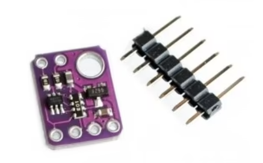
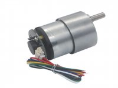

# 🚗 WRO 2026 Future Engineers — Team Glitch

<div align="center">

<!-- TEAM BANNER PLACEHOLDER -->
<!-- Replace with your banner image:  -->

[](https://www.youtube.com/@YOUR_CHANNEL)
[](https://www.instagram.com/YOUR_HANDLE)

</div>

---

## 📚 Table of Contents

- [👥 The Team](#-the-team)
- [🎯 Challenge Overview](#-challenge-overview)
- [🤖 Our Robot](#-our-robot)
- [🔧 Electronic Systems & Components](#-electronic-systems--components)
- [⚙️ Mechanical Systems](#️-mechanical-systems)
- [💻 Software Architecture](#-software-architecture)
- [🧭 Open Challenge — Strategy & Logic](#-open-challenge--strategy--logic)
- [🚧 Obstacle Challenge — Strategy & Logic](#-obstacle-challenge--strategy--logic)
- [🔄 Engineering Decisions & Iterations](#-engineering-decisions--iterations)
- [📹 Performance Videos](#-performance-videos)
- [🛠️ How to Build & Deploy](#️-how-to-build--deploy)

---

## 👥 The Team

<!-- Replace with your official team photo -->
<!--  -->

**PLACEHOLDER: Official Team Photo**

| Member | Role | Background |
|--------|------|------------|
| **[Shaurya  Sule]** | Mechanical Design, Electronics, Strategy |
| **[Rehaan Dhandhia]** | Software, Vision & Sensor Integration  |
| **[Zeus Wadia]** | Electronics, Testing, Documentation |

**Coach:** [Ajinkya Giri] 

<!-- Replace with your fun team photo -->
<!--  -->

**PLACEHOLDER: Fun Team Photo**

---

## 🎯 Challenge Overview

WRO 2026 Future Engineers is a self-driving car challenge where an autonomous robotic vehicle must complete three laps on a 3m × 3m racetrack that randomly changes configuration for each round. The competition has two challenge types:

**Open Challenge** — Complete three laps on a track with randomly configured internal walls. No traffic signs are present. The lane width changes per section (1000 mm or 600 mm). The goal is to navigate cleanly and quickly, stopping autonomously in the starting section after three laps.

**Obstacle Challenge** — Complete three laps while obeying red and green traffic sign pillars (red = keep right, green = keep left). After completing all three laps, the vehicle must identify the magenta-bordered parking lot and execute a parallel park within it. The parking space is exactly 1.5× the robot's length, and touching the magenta boundaries instantly ends the round.

Both challenges are Time Attack format — one vehicle at a time, scored on laps completed, traffic sign compliance, stopping position, and parking success.

---

## 🤖 Our Robot

<div align="center">

<table>
  <tr>
    <td align="center"><b>Front View</b></td>
    <td align="center"><b>Rear View</b></td>
  </tr>
  <tr>
    <td></td>
    <td></td>
  </tr>
  <tr>
    <td align="center"><b>Left Side</b></td>
    <td align="center"><b>Right Side</b></td>
  </tr>
  <tr>
    <td></td>
    <td></td>
  </tr>
  <tr>
    <td align="center"><b>Top View</b></td>
    <td align="center"><b>Bottom View</b></td>
  </tr>
  <tr>
    <td></td>
    <td></td>
  </tr>
  <tr>
    <td colspan="2" align="center"><b>Labeled Component View</b></td>
  </tr>
  <tr>
    <td colspan="2" align="center">
      
    </td>
  </tr>
</table>

</div>

### Key Specifications

| Parameter | Value |
|-----------|-------|
| **Dimensions** | [L] × [W] × [H] mm |
| **Weight** | ~[X] kg |
| **Drive Type** | Rear-wheel drive with 12V DC geared encoder motor |
| **Steering** | Servo-actuated Ackermann geometry |
| **Primary Brain** | Raspberry Pi 4 Model B (4 GB) |
| **Co-processor** | Seeed XIAO ESP32-C3 (IMU + encoder over USB UART) |
| **Vision** | USB Camera + OpenCV HSV pipeline (no Edge TPU) |
| **Spatial Awareness** | VL53L0X ToF sensor ×4 (point ranging, Pi I2C bus) |
| **Heading** | Adafruit BNO085 9-DOF IMU (on XIAO, I2C) |
| **Max Operating Speed** | ~95% PWM duty cycle (~[X] m/s measured) |

---

## 🔧 Electronic Systems & Components

### Component List

| Component | Image | Specifications | Role in Robot | Source |
|-----------|-------|---------------|---------------|--------|
| **Raspberry Pi 4 Model B (4GB)** |  | Quad-core Cortex-A72 @ 1.8GHz, 4 GB LPDDR4, USB 3.0, GPIO 40-pin | Main compute — runs vision (Edge TPU ML), LiDAR parsing, servo/motor PID control via pigpio | [robu.in](https://robu.in/product/raspberry-pi-4-model-b-with-4-gb-ram/) |
| **Seeed XIAO ESP32-C3** |  | ESP32-C3 RISC-V single-core @160MHz, 400KB SRAM / 4MB Flash, 11× GPIO (PWM), 4× ADC, 1× I2C, UART @115200 baud, USB-C, 3.3V logic, 21×17.5mm | Co-processor — reads BNO085 IMU over a dedicated 3.3V I2C bus and the drive-motor quadrature encoder, streams fused heading + encoder counts to the Pi over USB UART at 115200 baud (`/dev/XIAO_USB`). Isolates timing-critical encoder counting from the Pi's non-real-time scheduler | [robu.in](https://robu.in/product/seeed-studio-xiao-esp32c3/) |
| **VL53L0X ToF (×4)** |  | Range: 0.03–2m, Accuracy: ±3% (<1.2m indoor), FOV 25°, I2C 400kHz (addr 0x29, volatile), timing budget 20–200ms, 2.6–3.5V | Point-range sensors on the shared Pi I2C bus: [FILL IN: front / left / right / rear roles]. Per-sensor XSHUT lines for boot-time address assignment and fault isolation | [Robu.in](https://robu.in/product/vl53l0x-tof-based-lidar-laser-distance-sensor/?gad_source=1&gad_campaignid=20363337560&gbraid=0AAAAADvLFWfotmxaIMn2p8HarXqqe6Nff&gclid=Cj0KCQjwguLSBhDLARIsAH-yPrFK-kzvw4y6FspLzuAcA_oIxhydmxn_V0OlvkelbwEPyBRH6SLhxZoaAjEbEALw_wcB) |
| **Adafruit BNO085 IMU** |  | 9-DOF (accel + gyro + mag), onboard ARM Cortex-M0 fusion, Euler output at 100Hz, I2C | Absolute heading for PID steering correction; prevents drift accumulation across all 3 laps | [evelta.com](https://evelta.com/adafruit-bno085-9-dof-orientation-imu-fusion-breakout/?sku=076-4754&utm_source=google&utm_campaign=20308067004&utm_medium=cpc&utm_content=&utm_term=&gad_source=1&gad_campaignid=20317564702&gbraid=0AAAAADwtsXnePMHtpbMiYnB4cO9_u_84B&gclid=Cj0KCQjwguLSBhDLARIsAH-yPrFOSs2EfI8E-wKMQBoJWDIA7mjCOec-1VZXfBmPrgCMb-ZPmXS2ELQaAu9GEALw_wcB) |
| **USB Camera** |  | 2MP, 1080P @ 30fps, ultra-wide angle, USB 2.0, manual focus | Input for OpenCV HSV-based colour detection pipeline (`vision_pipeline_new.py`) — detects red/green pillar blocks, magenta parking markers, orange/blue floor lines, and black wall boundaries. No ML accelerator required. Exposure is fixed (`CAP_PROP_EXPOSURE = -6`) and buffer is capped at 1 frame to minimise detection latency | [amazon.in](https://www.amazon.in/HIKVISION-DS-U02-Distortion-Adjustment-Conferencing/dp/B0929FSQ2J) |
| **Rhino GB37 12V 1000RPM Encoder Motor** (RMCS-4091) |  | 12V DC, 1000RPM (no-load), 0.7 kg·cm, 37mm spur gearbox, D-type output shaft, quadrature encoder (SPEED_SCALE ≈ 2447 counts/sec at full duty), all-metal construction | Rear-wheel drive via MDD3A driver (PIN_A = GPIO16, PIN_B = GPIO20) under pigpio PWM. Quadrature encoder feeds the XIAO ESP32-C3 for closed-loop speed PID (`correctSpeed`) and odometry (`counts` shared value) | [robokits.co.in](https://robokits.co.in/motors/rhino-gb37-12v-dc-geared-motor/dc-12v-encoder-servo-motors/rhino-gb37-12v-1000rpm-0.7kgcm-dc-geared-encoder-servo-motor) |
### Power Architecture

The robot uses a **dual-rail power system** — one rail for electronics and one for the motor. This separation is critical: the motor causes PWM-induced voltage spikes that corrupt sensor readings when sharing a supply rail. We learned this the hard way during early testing where BNO055 readings would glitch during rapid acceleration.

```
[12V LiPo Battery]
       |
       ├── [MDD3A Motor Driver (PIN_A=GPIO16, PIN_B=GPIO20)] ──> Rhino GB37 1000RPM Motor
       |
       └── [5V Buck Converter / Regulator]
                   |
                   ├── Raspberry Pi 4 (5V/3A USB-C)
                   │       └── [Pi 3V3 rail] ──> VL53L0X ×4 (I2C, XSHUT: GPIO23/24/25/27)
                   ├── Servo Motor (dedicated UBEC/buck ≥5A, DS 35kg·cm class)
                   └── Seeed XIAO ESP32-C3 (via USB-C from Pi)
                           └── [XIAO 3V3 rail] ──> BNO085 IMU (I2C, XIAO-exclusive)
                                                    Quadrature Encoder (GPIO)

[I2C Bus — XIAO exclusive] XIAO ←→ BNO085 (3.3V logic)
[I2C Bus — Pi exclusive]   Pi   ←→ VL53L0X ×4 (3.3V logic, per-sensor XSHUT isolation)
[UART 115200]              XIAO → Pi (/dev/XIAO_USB) — heading (float) + encoder counts (int)
[USB]                      Pi   ← Camera (UVC /dev/video0)
```

**Power budget estimate:**

| Component | Voltage | Typical Current |
|-----------|---------|-----------------|
| Rhino GB37 1000RPM Motor (loaded) | 12V | 300mA typical (stall: ~1.0–1.3A est.) |
| Raspberry Pi 4 | 5V | 1.0–1.5A |
| Seeed XIAO ESP32-C3 | 5V (via Pi USB) | 25–40mA |
| VL53L0X sensor ×4 | 3.3V (Pi rail) | 4 × 19mA = 76mA |
| DS 35kg·cm servo | 5–6V (dedicated UBEC) | 5mA idle, ~2.0A stall |
| **Total (peak, referred to 12V pack)** | — | **~3.3A** |

### Wiring Diagram

****


### Sensor Placement Rationale

Every sensor placement was deliberate and tested before being finalized:

**Vl530x — Head (GPIO 23):** Mounted front-center facing forward. Detects approaching inner or outer wall during straight sections. Turn is triggered when the front distance drops below a threshold (950mm for obstacle challenge, adjusted per phase). We initially placed this sensor angled 15° downward, which caused premature ground reflections at distances under 80cm. Moving it to horizontal mount fixed false triggers.

**Vl530x — Left (GPIO 24) & Right (GPIO 25):** Mounted at mid-body height on the left and right flanks. Used for: (a) initial direction detection in the Open Challenge by reading which side has >100mm clearance, (b) wall-follow PID correction when no block is detected, (c) parking confirmation when the side distance drops below 25mm. The separation between left and right is the reason we can reliably detect which side of the track the robot starts on.

**Vl530x — Back (GPIO 27):** Mounted rear-facing. Used during reverse parking maneuvers to sense wall approach from behind, preventing collisions during the multi-stage parking sequence.


**Camera:** Mounted front-facing, angled slightly downward and backwards to capture traffic signs as the robot approaches. Exposure is manually fixed (`CAP_PROP_EXPOSURE = -6`) to prevent auto-exposure flicker when transitioning between light and dark sections of the track — a major source of false negatives during early testing.

**BNO085 IMU:** Mounted flat on the XIAO ESP32-C3 board, away from the motor and motor driver to minimize magnetic interference from the motor's commutator. The BNO085 is powered exclusively from the XIAO's 3.3V rail (isolated from the Pi's rail) to prevent EMI-induced heading glitches. We measured a consistent 3° heading drift during stall-condition motor tests with the IMU within 40mm of the motor. Moving it 80mm away eliminated this.

---

## ⚙️ Mechanical Systems

### Chassis Design

**PLACEHOLDER: `models/chassis_overview.jpg`**

The chassis is built on a [custom fabricated / RC car base — fill in]. The rear axle is driven by the Johnson 600RPM motor through a [direct coupling / gear reduction — fill in]. The front axle uses Ackermann-geometry steering actuated by a servo motor.

**Why Ackermann geometry?** A parallel steering linkage (where both front wheels turn by the same angle) causes the inner wheel to skid on tight turns because each wheel follows a different radius. Ackermann geometry adjusts each wheel's angle independently so both track their respective arc centers — reducing tire scrub, preserving traction, and improving the predictability of the turn radius for PID tuning.

**Turning radius calculation:**

```
Wheelbase (L)     = [X] mm
Track width (T)   = [Y] mm
Max servo angle   = [Z] degrees

Inner wheel angle:  δ_inner = arctan(L / (R - T/2))
Outer wheel angle:  δ_outer = arctan(L / (R + T/2))
Minimum turn radius R_min ≈ [calculated value] mm
```

This minimum turn radius was critical — the inner wall during a 600mm-wide corridor leaves very little margin. Our first chassis prototype had a wheelbase of [X]mm which gave R_min of [Y]mm, too large to reliably exit tight corridors. We shortened the wheelbase to [Z]mm in iteration 2, reducing R_min to [W]mm, which cleared the constraint.

### Drive System

**Motor Selection Reasoning:** We evaluated several motor options and settled on the Rhino GB37 12V 1000RPM encoder motor for the current season:

| Option | RPM | Torque | Verdict |
|--------|-----|--------|---------|
| Johnson 300 RPM | 300 | ~8 kg·cm | Too slow for sub-60s laps |
| Johnson 600 RPM | 600 | 4.5 kg·cm | Used in prior season; adequate but limited top speed |
| **Rhino GB37 1000RPM ✓** | **1000** | **0.7 kg·cm** | **Current choice — higher speed, closed-loop speed PID compensates for torque reduction** |

At 1000 RPM with a wheel diameter of approximately [D] mm:

```
Linear speed = (RPM / 60) × π × D
             = (1000 / 60) × π × [D/1000]
             ≈ [X] m/s at 100% PWM
```

We operate the motor under closed-loop speed PID (`correctSpeed`) with a `SPEED_SCALE` of ~2447 counts/sec at full duty on a fresh battery. The speed PID (positional form, `kp_v`/`ki_v`/`kd_v` hot-reloaded from `gains.json`) corrects duty cycle to maintain a target speed regardless of battery voltage sag. The quadrature encoder feeds the XIAO ESP32-C3 which streams signed counts to the Pi over UART for both speed control and odometry. **Note:** the Open Challenge does not use speed PID — it runs a simple exponential smoothing ramp (`power * 0.01 + prev_power * 0.99`) at 85% target duty, which is sufficient for the simpler wall-following task.

### Iteration History

**PLACEHOLDER: `models/iteration_comparison.jpg`** — Side-by-side of v1 and v2 chassis

**Version 1 (Regional):**
- RC car base with unmodified steering geometry
- Single front TOF sensor — turn detection relied purely on distance threshold
- Arduino Mega co-processor for IMU + encoder
- Google Coral Edge TPU for object detection (TFLite quantized model)
- Problem: Could not reliably distinguish narrow vs. wide corridors; missed turns in tight sections

**Version 2 (National):**
- Added RPLidar C1 for reliable turn detection (compound condition: front <950mm + open side >1500mm)
- Added left + right TOF sensors for wall-follow PID
- Remounted camera with fixed exposure; removed inline `cv2.imshow` for full-speed capture
- Problem: Parking was unreliable — single-pass approach often overshot; LiDAR subprocess added complexity

**Version 3 (World Final — Current):**
- Replaced Arduino Mega + Coral Edge TPU + RPLidar C1 with a leaner stack:
  - **Seeed XIAO ESP32-C3** handles IMU (BNO085) + encoder over USB UART
  - **4× VL53L0X ToF** replace the LiDAR (front/left/right/rear point distances)
  - **OpenCV HSV pipeline** replaces Edge TPU ML model
- Switched to **Rhino GB37 1000RPM** encoder motor with closed-loop speed PID
- Multi-stage parking state machine driven by camera black-zone detections (`park_wall`, `last_wall`)
- Hot-reloadable `gains.json` for live PID tuning without restarts
- Dual-rail power, per-sensor XSHUT I2C isolation, and EMI separation resolved sensor noise

---

## 💻 Software Architecture

The software runs on the Raspberry Pi 4 using Python's `multiprocessing` module. Each major function runs as a separate OS process with its own memory space, communicating exclusively through `multiprocessing.Value` shared variables. This design prevents a slow vision inference cycle from blocking the time-critical steering loop.

### Process Architecture

```
┌─────────────────────────────────────────────────────┐
│                    Main Process                      │
│       Spawns all child processes, then exits        │
└──────┬──────────────┬──────────────┬────────────────┘
       │              │              │              │
┌──────▼──────┐ ┌─────▼──────┐ ┌────▼──────┐ ┌───▼────────────┐
│CameraProcess│ │IMUandEncoder│ │TOFProcess │ │ DriveProcess   │
│  (P)        │ │  (E)        │ │  (T)      │ │  (S) MAIN LOOP │
│ OpenCV HSV  │ │ /dev/XIAO   │ │ VL53L0X×4 │ │ Reads ALL      │
│ pipeline    │ │ _USB UART   │ │ Pi I2C    │ │ shared vars    │
│ → red_b     │ │ → head.value│ │→tof_front │ │ PID steering   │
│ → green_b   │ │ →counts.val │ │→tof_left  │ │ Speed PID      │
│ → pink_b    │ │             │ │→tof_right │ │ State machine  │
│ → centr_x/y │ │             │ │→tof_rear  │ │ Motor + servo  │
│ → wall_left │ │             │ │           │ │ control        │
│ → wall_right│ │             │ │           │ │                │
└─────────────┘ └─────────────┘ └───────────┘ └────────────────┘
```

**Shared variables (cross-process, lock-protected):**

| Variable | Type | Written by | Read by | Purpose |
|----------|------|-----------|---------|---------|
| `head` | float | IMUandEncoder | DriveProcess, CameraProcess | IMU heading (degrees) from BNO085 via XIAO |
| `counts` | int | IMUandEncoder | DriveProcess | Quadrature encoder pulse count for odometry and speed PID |
| `red_b` | bool | CameraProcess | DriveProcess | Red pillar visible |
| `green_b` | bool | CameraProcess | DriveProcess | Green pillar visible |
| `pink_b` | bool | CameraProcess | DriveProcess | Magenta parking marker visible |
| `centr_x/y` | float | CameraProcess | DriveProcess | Closest green/red pillar centroid |
| `centr_x_red/y_red` | float | CameraProcess | DriveProcess | Red pillar centroid |
| `centr_x_pink/y_pink` | float | CameraProcess | DriveProcess | Pink marker centroid |
| `wall_left/right` | double | CameraProcess | DriveProcess | Inner wall detection flags (from black HSV zones) |
| `outer_wall_left/right` | double | CameraProcess | DriveProcess | Outer wall detection flags |
| `close_wall` | double | CameraProcess | DriveProcess | Close black wall area (for turn/parking logic) |
| `park_wall` | double | CameraProcess | DriveProcess | Parking wall area (black HSV, parking zone) |
| `orange_l / blue_l` | bool | CameraProcess | DriveProcess | Floor line colour for lap direction detection |
| `tof_front/left/right/rear` | double | TOFProcess | DriveProcess | VL53L0X distance readings (mm) for turn detection, wall-follow, and parking |
| `switch_state` | bool | CameraProcess | DriveProcess | Kill-switch state shared to camera for early exit |

### PID Steering Control (`correctAngle`)

Steering is controlled by a proportional-derivative (PD) controller. The integral term `ki` is set to 0 in the obstacle challenge to avoid windup during block avoidance transitions — a lesson learned after the robot over-corrected and hit a wall when ki was non-zero.

```python
# Core PID (from correctAngle)
error_gyro = heading - setPoint_gyro
if error_gyro > 180:
    error_gyro -= 360          # Handle angle wraparound

pTerm = kp * error_gyro * multiplier   # kp = 0.6
dTerm = kd * ((error_gyro - prevErrorGyro) / dt)  # kd = 0.01
correction = pTerm + dTerm
correction = max(-25, min(25, correction))  # clamp

servo.setAngle(95 - correction)  # 95° is mechanical center
```

The `multiplier` parameter scales aggressiveness: `1.0` for normal straight-line heading hold, `1.5` for block-tracking and most driving situations, `3.0` for tight parking turns. This avoids having multiple PID instances for the same physical task. `correctReverseAngle` mirrors the same structure but applies correction in the opposite servo direction (`95 + correction`) for reverse maneuvers.

### Obstacle Avoidance — Centroid PD Control

Pillar avoidance does not use dead-reckoning or `setPoint` position control. Instead, `DriveProcess` computes a servo correction directly from the detected pillar's pixel centroid (`centr_x` for green, `centr_x_red` for red) using a PD controller on the image error:

```python
# err = pixel offset from target centroid position
if green_b.value:
    if obstacle_state == 1:   # block still far
        err = 350 - centr_x   # steer to pass left of green
    elif obstacle_state == 2: # block is close
        err = 560 - centr_x
elif red_b.value:
    if obstacle_state == 1:
        err = 290 - centr_x_red  # steer to pass right of red
    elif obstacle_state == 2:
        err = 80 - centr_x_red

# PD on centroid error (kp_s, kd_s from gains.json)
servo_angle = err * kp_s + ((err - prev_err) / dt_main) * kd_s
servo_angle = max(-35, min(35, servo_angle))
servo.setAngle(95 - servo_angle)
```

`obstacle_state` switches from 1 → 2 when `centr_y > 100` (block is close, larger in frame), sharpening the avoidance offset. It resets back to 1 once the block exits the close zone or a pink/wall boundary is detected nearby. When no block is visible, wall-correction uses `wall_left`/`wall_right` centroid-X to apply a fixed `err = ±15` nudge toward center.

### TOF Turn Detection (`TOFProcess`)

The `TOFProcess` runs 4× VL53L0X sensors on the Pi's I2C bus with per-sensor XSHUT isolation (GPIO 23/24/25/27). Sensors are assigned unique I2C addresses at boot time by sequentially un-shutting each sensor and remapping its address — pulling all XSHUT lines low during a single-sensor recovery would corrupt the other sensors' volatile addresses, so each sensor is isolated individually.

Turn detection in `DriveProcess` uses the shared `tof_front` and `tof_left`/`tof_right` readings:

```python
# Turn condition (example — CW/CCW logic applies Orange/Blue):
if tof_front.value < 950 and (tof_right.value > 1500 or tof_left.value > 1500):
    # wall ahead + open corridor beside → genuine corner
    counter += 1
    heading_angle += 90  # or -=90 for CCW
```

The 20ms timing budget (reduced from the 33ms default for polling speed) is validated for normal ranges; distances under ~20cm may under-report due to the reduced budget and are flagged in test logs.

---

## 🧭 Open Challenge — Strategy & Logic

The Open Challenge uses a separate script (`open_challenge.py`) with its own vision pipeline (`vision_pipeline_3.py`) and a simpler control stack — no speed PID, no obstacle avoidance states, no parking sequence. The same 4-process architecture runs: `CameraProcess`, `IMUandEncoder`, `TOFProcess`, and `DriveProcess`.

### State Machine

```
              [INIT]
                │
                ▼
     ┌──────────────────────────────────────┐
     │   Wait for any sensor input          │
     │   (pink/red/green block, or wall)    │
     │   → init = True, servo centred 65°   │
     └──────────────┬───────────────────────┘
                    │
                    ▼
     ┌──────────────────────────────────────────────┐
     │  DIRECTION DETECTION (first trigger only)    │
     │                                              │
     │  (tf_h < 70mm AND tf_l > 100mm) OR blue_l   │
     │      → blue_flag = True (CCW)                │
     │      → trigger = True, counter_flag = False  │
     │                                              │
     │  (tf_h < 70mm AND tf_r > 100mm) OR orange_l  │
     │      → orange_flag = True (CW)               │
     │      → trigger = True, counter_flag = False  │
     └──────────────┬───────────────────────────────┘
                    │
                    ▼
     ┌──────────────────────────────────────────────────────┐
     │  DRIVING LOOP  (counter < last_counter = 12)         │
     │                                                      │
     │  Steering priority (highest to lowest):              │
     │   1. Both outer walls visible:                       │
     │        err = centre offset from outer wall centroids  │
     │        servo.setAngle(90 + servo_angle)              │
     │   2. One outer wall visible:                         │
     │        err = ±centroid offset from frame centre      │
     │        servo.setAngle(90 + servo_angle)              │
     │   3. Inner wall visible (counter > 0):               │
     │        wall_left only  → correctAngle(hdg + 10, 1)   │
     │        wall_right only → correctAngle(hdg - 10, 1)   │
     │   4. Fallback:                                       │
     │        correctAngle(heading_angle, head, 1)          │
     │                                                      │
     │  Motor: power = 85%, smoothed ramp                   │
     │     total_power = power*0.01 + prev_power*0.99       │
     └──────────────┬───────────────────────────────────────┘
                    │
        ┌───────────▼───────────────────────────┐
        │  TURN TRIGGER (floor line detection)  │
        │                                       │
        │  orange_l AND orange_flag AND no trig │
        │      → trigger = True                 │
        │      → counter_flag = False           │
        │                                       │
        │  blue_l AND blue_flag AND no trig     │
        │      → trigger = True                 │
        │      → counter_flag = False           │
        │                                       │
        │  Trigger resets after 2s timeout      │
        └───────────┬───────────────────────────┘
                    │
        ┌───────────▼───────────────────────────────────────┐
        │  TURN EXECUTION (counter_flag=False AND trigger)  │
        │                                                   │
        │  Drive forward until close_wall > 0               │
        │  (OR open-side TOF > 100mm → skip wall wait)      │
        │  Then: counter++                                   │
        │  heading_angle = update_heading(counter, ...)     │
        │  counter_flag = True                              │
        │  trigger reset after 2s                           │
        └───────────┬───────────────────────────────────────┘
                    │
                    ▼ counter == 12 (3 laps × 4 turns)
     ┌──────────────────────────────────────────────────────┐
     │  STOP CONDITION (all must be true simultaneously):   │
     │    • NOT trigger (no active turn in progress)        │
     │    • time since last trigger > 3.5s                 │
     │    • get_closest_setpoint(head) == heading_angle     │
     │    • last_wall.value > 0 (stop line visible)         │
     │  → runMotor(pwm, 0, 1) → sys.exit(0)                │
     └──────────────────────────────────────────────────────┘
```

### Steering — Outer Wall Centroid PD

Unlike the Obstacle Challenge (which steers toward pillar centroids), the Open Challenge drives purely by wall geometry. The outer walls are detected as black HSV blobs in `wall_left` and `wall_right` camera zones; their centroid-X positions are used to compute a lateral centering error:

```python
# Both outer walls visible — compute centre between them
if outer_wall_left.value > 0 and outer_wall_right.value > 0:
    left_offset  = 320 - outer_wall_left.value
    right_offset = 320 + (640 - outer_wall_right.value)
    centroid = (left_offset + right_offset) / 2
    err = 320 - centroid

# Left wall only
elif outer_wall_left.value > 0:
    err = outer_wall_left.value / 2          # push right

# Right wall only
elif outer_wall_right.value > 0:
    err = -(640 - outer_wall_right.value) / 2  # push left

# PD output
servo_angle = err * kp_s + ((err - prev_err) / dt_main) * kd_s
servo_angle = max(-25, min(25, servo_angle))
servo.setAngle(90 + servo_angle)   # 90° is mechanical centre in open challenge
```

When no outer wall is visible, fallback is inner wall centroid bias (`correctAngle(heading ± 10)`) or pure heading PID (`correctAngle(heading_angle, head, 1)`).

### Turn Detection — Floor Line Colour

Turns are triggered by floor line colour detections (`orange_l`, `blue_l`) from the HSV pipeline (`zone = "line"`), not by TOF distance thresholds. On each trigger:
- A `map_time` delay is computed from the side TOF distance (`map_range(tf_l/tf_r, 0, 100, 0, 0.7)`) to time the corner entry
- The robot continues driving forward until `close_wall` (inner wall area) becomes non-zero, then commits the counter increment
- If the open-side TOF reads > 100mm, it breaks the wall-wait early to avoid stalling mid-turn
- Trigger resets automatically after a 2s timeout to prevent double-counting

### Stop Condition

The stop condition requires **four simultaneous conditions** to prevent premature halts:
- `counter == 12` (all 12 turns completed)
- No active trigger (`not trigger`)
- At least 3.5 seconds since the last trigger fired
- `get_closest_setpoint(head.value) == heading_angle` (IMU heading matches expected return angle)
- `last_wall.value > 0` (the stop-line wall is visible in the camera)

The `get_closest_setpoint` function snaps the current IMU heading to the nearest of `{0°, 90°, 180°, 270°}`, ensuring the robot is approximately back at the start orientation before stopping.

### Key differences from Obstacle Challenge

| Aspect | Open Challenge | Obstacle Challenge |
|--------|---------------|-------------------|
| Vision pipeline | `vision_pipeline_3.py` | `vision_pipeline_new.py` |
| Servo centre | 90° | 95° |
| Steering method | Outer wall centroid PD | Pillar centroid PD + heading PID |
| Speed control | Smoothed ramp only (`0.01/0.99`) | Closed-loop speed PID (`correctSpeed`) |
| Turn trigger | Floor line colour | Floor line colour |
| Stop condition | 4-condition compound check | Encoder count target |
| Parking | None | 4-state parking sequence |
| `last_wall` value | centroid-X of stop-line blob | area of last-wall blob |

---

## 🚧 Obstacle Challenge — Strategy & Logic

### Full State Machine

```
[STARTUP]
    │
    ├── Init CameraProcess (P)  — OpenCV HSV pipeline
    ├── Init IMUandEncoder (E)  — XIAO UART reader (BNO085 + encoder)
    ├── Init TOFProcess (T)     — VL53L0X ×4
    └── Start DriveProcess (S)  — main decision loop
         │
         ▼
[DIRECTION + PARKING SIDE DETECTION]
    │  (outer_wall_left > 0 AND NOT outer_wall_right) OR (tf_l < tf_r)
    │       → orange_flag = True (parking lot is on the right, CW)
    │  (outer_wall_right > 0 AND NOT outer_wall_left) OR (tf_r < tf_l)
    │       → blue_flag = True (parking lot is on the left, CCW)
    ▼
[STARTUP MANEUVER — inParkingatStart]
    │  Robot steers ±60° away from wall then straightens
    │  (orange: correctAngle(heading + 60), blue: correctAngle(heading - 60))
    ▼
[DRIVING LOOP — counter < last_counter (default 12 = 3 laps × 4 turns)]
    │
    ├── Pillar detected?
    │       Green → err = 350 - centr_x (state 1) / 560 - centr_x (state 2)
    │       Red   → err = 290 - centr_x_red (state 1) / 80 - centr_x_red (state 2)
    │       None  → wall_left/right centroid → err = ±15 nudge
    │       Pink + continue_parking → err toward centr_x_pink setpoint
    │
    ├── Centroid PD: servo_angle = err * kp_s + (err_diff / dt) * kd_s
    │       obstacle_state 1→2 when centr_y > 100 (block close)
    │       obstacle_state 2→1 when block clears or pink/close_wall nearby
    │
    ├── Turn trigger: orange_l (CW) or blue_l (CCW) floor line detected
    │       → trigger = True, counter_flag = False
    │       → counter++ when trigger fires
    │       → heading_angle updated via update_heading(counter, ...)
    │       → trigger resets after 2s timeout
    │
    └── No block + outer walls visible: correctAngle(heading ± 20) wall bias

[LAP FINISH — counter == last_counter]
    │
    ├── Drive to closest heading setpoint, wait for close_wall to appear
    ├── Reverse to align (correctReverseAngle), then resume forward
    ├── Compute target encoder count from parking side + direction:
    │       orange + parking_right: counts + 5800
    │       orange + parking_left:  counts + 3700
    │       blue   + parking_right: counts + 3700
    │       blue   + parking_left:  counts + 5800
    │       (finish_thresh: 1400 or 1900 depending on config)
    ├── Drive forward until counts >= target_count
    └── Stop → lap_finish = True

[PRE-PARKING — lap_finish, NOT continue_parking]
    │  orange_flag: heading_angle += 90 (turn to face slot)
    │  blue_flag:   heading_angle -= 95 (turn to face slot)
    │  Reverse to align (correctReverseAngle), drive until park_wall > 4500 area
    │  then forward until park_wall < 4500, stop → parking_STATE = 2
    │  Adjust heading ±95°, reverse until corr < 5° → continue_parking = True

[CONTINUE PARKING — continue_parking, NOT parking_flag]
    │  Drive forward at power=50
    │  If last_wall > 1350 AND heading aligned AND no pink → parking_flag = True
    │  Steer toward pink centroid (centr_x_pink) if visible, else correctAngle

[MAIN PARKING — parking_flag]
    │
    ├── [STATE 1] Reverse 100 encoder counts straight
    │
    ├── [STATE 2] heading_angle ± 90° (into slot)
    │       Reverse until corr < 10°, then reverse 1.5s more
    │
    ├── [STATE 3] Forward 0.55s: first 0.2s straight, then steer into slot
    │       (parking_right → servo 70°, parking_left → servo 110°)
    │
    └── [STATE 4] heading_angle - 90° (straighten)
            Reverse until corr < 3°
            Drive forward until centr_y_pink > 235 (fully inside lot)
            → Motor stop, servo center, sys.exit(0)
```

### Vision System — OpenCV HSV Pipeline

The `CameraProcess` runs `vision_pipeline_new.py` — a pure OpenCV HSV colour-segmentation pipeline with no ML accelerator required. It detects the following colour classes across named spatial zones:

| Colour | Zone(s) | Role |
|--------|---------|------|
| Red | `main`, `close` | Red traffic sign pillar |
| Green | `main`, `close` | Green traffic sign pillar |
| Magenta | `main`, `close` | Parking lot boundary marker |
| Orange | `line`, `line_2` | Floor line — CW lap direction |
| Blue | `line`, `line_2` | Floor line — CCW lap direction |
| Black | `wall_inner_left/right`, `wall_left/right`, `close_black`, `parking_wall`, `last_wall` | Inner/outer wall and parking zone boundaries |

**Why HSV over ML?**
Last season we used a Google Coral Edge TPU with a quantized TFLite model. This season we moved to an HSV pipeline for simpler deployment (no TPU driver stack), faster iteration on colour thresholds, and elimination of the TPU as a failure point. To handle lighting variation we run the pipeline in both HSV and LAB colour spaces (`USE_LAB` flag) and tune thresholds per colour class.

**Detection logic:**
Each frame's detections are filtered by zone and sorted by centroid-Y (largest Y = closest to robot). If red and green pillars are both visible simultaneously, the one with the greater centroid-Y (closer) takes priority:

```python
# Both present — closest pillar wins
if best_green["centroid"][1] > best_red["centroid"][1]:
    # green is closer → steer left
else:
    # red is closer → steer right
```

**Camera settings fixed in code:**
```python
cap.set(cv2.CAP_PROP_EXPOSURE, -6)      # manual exposure, prevents auto-exposure flicker
cap.set(cv2.CAP_PROP_BUFFERSIZE, 1)     # always process latest frame
```
Setting `BUFFERSIZE = 1` ensures we always process the most recent frame. Without this, OpenCV buffers up to 3–4 frames internally, meaning at 30fps the detection could be 133ms stale — enough for the robot to travel past a pillar without reacting.

**Post-run video reconstruction:** During a run, frames and timestamps are written to disk. A separate `build_video.py` script reconstructs an annotated MP4 using ffmpeg's concat demuxer with per-frame durations — enabling post-run review without the overhead of `cv2.VideoWriter` in the live loop.

---

## 🔄 Engineering Decisions & Iterations

This section documents the reasoning behind major architectural choices and the iterations that led to the current design. This is the essence of the engineering process — not just showing what we built, but why we built it this way.

### Decision 1: VL53L0X ToF Array vs. RPLidar C1

**Last season's approach:** Turn detection used an RPLidar C1 spinning LiDAR, which provided 360° distance data. The turn condition was:
```
Front LiDAR < 950mm AND Open-side LiDAR > 1500mm AND timeout elapsed
```
This was reliable but added significant complexity: the LiDAR required a dedicated subprocess to parse the SLAMTEC SDK binary output, angle compensation for IMU heading offset, and EMA smoothing per angle bucket. The spinning motor also added vibration and a non-trivial power draw.

**This season's approach:** We replaced the RPLidar with a VL53L0X ToF array (×4: front, left, right, rear). Each sensor reads a single point distance over I2C, giving the same compound turn condition with far simpler code and no subprocess overhead. Per-sensor XSHUT lines (GPIO 23/24/25/27) allow boot-time address assignment and fault isolation at runtime.

**Tradeoff acknowledged:** VL53L0X has a 25° FOV vs. the LiDAR's full 360°. However, since we only need front/left/right/rear point distances for this state machine, the narrower FOV is not a practical limitation. Sensor recovery logic (bit-bang bus reset for SDA-held-low conditions, per-sensor XSHUT isolation, rate-limited retry) handles the I2C robustness cases that the serial LiDAR approach never needed.

### Decision 2: Multiprocessing vs. Single-threaded with async

**The problem:** During early single-threaded development, sensor I/O and camera frame reads blocked the main loop for 10–15ms per cycle. At 95% PWM the robot travels ~15mm blind per blocked millisecond — enough to miss a narrow turn window or fail to react to a close pillar.

**The fix:** Python's `multiprocessing` (not `threading`) was chosen deliberately. Python threads are limited by the Global Interpreter Lock (GIL), meaning CPU-bound tasks like OpenCV HSV detection and I2C polling don't actually run in parallel. `multiprocessing` spawns true OS processes, each with their own GIL, allowing `CameraProcess`, `TOFProcess`, and `IMUandEncoder` to run at full speed on separate CPU cores of the Pi 4's quad-core processor while `DriveProcess` reads only from shared memory with no blocking waits.

**Tradeoff acknowledged:** Shared memory requires explicit locking (`multiprocessing.Value` with `get_lock()`). We encountered one race condition early in development where `head.value` was written by `IMUandEncoder` simultaneously with a read in `DriveProcess`. Fixed by using atomic `with` blocks for all multi-variable reads where consistency across variables matters.

### Decision 3: Centroid PD vs. encoder dead-reckoning for pillar avoidance

**Last season's approach:** We used an `EncoderCounter` dead-reckoning system to maintain an (x, y) position estimate within each straight section. A `setPoint` variable defined a target lateral offset, and a `correctPosition` PD controller minimized the error between estimated position and setpoint. When a pillar was detected, setPoint shifted toward ±35 (right/left bias); TFmini readings snapped the position back at each section start to limit drift.

**Why we moved away:** Dead-reckoning position error accumulated across sections and required a reliable wall-reset trigger to stay useful. Adding the TOF reset logic introduced its own failure modes; in testing, position drift of ±30 units by lap 3 was still causing avoidance misses at high speed.

**This season's approach:** Avoidance is driven directly by the pillar's pixel centroid in the camera frame. The `err` variable is computed as a pixel offset from a target centroid X position (e.g. `350 - centr_x` for green in state 1), and a simple PD on that pixel error (`kp_s`, `kd_s` from `gains.json`) outputs a servo angle correction. This runs at camera FPS with no positional state to accumulate drift, and target centroid setpoints can be tuned directly from video review.

### Decision 4: Parking sequence — why multi-stage?

The WRO 2026 parking rules require the robot to be fully inside the parking lot AND parallel to the outer wall. A simple forward drive into the slot fails because the robot approaches at a slight angle from the final turn. Our 4-state sequence:

- **STATE 1:** Reverse 100 encoder counts straight (exit the approach angle)
- **STATE 2:** Steer heading ±90° and reverse into the slot until `corr < 10°`, then reverse 1.5s more for depth
- **STATE 3:** Short forward burst (0.55s): first 0.2s straight, then servo to `70°`/`110°` to press into the slot
- **STATE 4:** Final heading correction (`heading - 90°`), reverse until straight (`corr < 3°`), then drive forward until `centr_y_pink > 235` (pink border fills the bottom of frame = robot fully inside)

The pink centroid threshold in STATE 4 is the terminal condition — it's a direct visual confirmation that the robot is fully seated inside the lot, regardless of encoder count or time.

---

## 📹 Performance Videos

### Open Challenge

<!-- Replace with your actual YouTube link -->
**PLACEHOLDER: Open Challenge Video**

[](https://youtu.be/YOUR_VIDEO_ID)

*Autonomous navigation across randomized track layout — 3 complete laps, return to start.*

### Obstacle Challenge

**PLACEHOLDER: Obstacle Challenge Video**

[](https://youtu.be/YOUR_VIDEO_ID_2)

*Traffic sign detection and compliance, followed by parallel parking execution.*

---

## 🛠️ How to Build & Deploy

This section is written so that anyone can replicate our robot from scratch — mechanical frame, electronics, firmware, and software — using only this repository and the component list above.

---

### Step 1 — 3D Print the Chassis

All structural and CAD files are in the `models/` folder of this repository:

```
models/
├── 3D prints/                              # STL and project files — slice and print directly
│   ├── all part 3d print file.3mf          # Complete multi-part print project (open in Bambu/PrusaSlicer)
│   ├── project file.3mf                    # Alternate slicer project
│   ├── new camera mount.STL               # Camera mount with 10° downward tilt
│   ├── long stick.STL                     # Vertical sensor mast
│   ├── long stick mount.STL               # Base mount for sensor mast
│   ├── front cover.STL                    # Front bumper cover
│   ├── battery 1.STL                      # Battery holder
│   ├── an_6_12_holder.STL                 # 6mm/12mm rod holder
│   ├── an_spacer internationale.STL       # Spacer for international chassis spec
│   ├── spacer with tf mount.STL           # Spacer with sensor bracket
│   ├── tf mini mount horizontal.STL       # Horizontal sensor bracket (legacy, for reference)
│   ├── atfmini mounting.STL               # Alternate sensor mounting bracket
│   ├── rp lidar mount.STL                 # RPLidar mount (legacy, for reference)
│   └── an waveshare 5 inch dsi lcd.STL    # Display mount (optional)
└── STEP/                                  # Editable CAD files (SolidWorks, Fusion 360, OnShape, FreeCAD)
    ├── WRO FE Car complete CAD.STEP        # Full robot assembly — start here
    ├── chassis_Polycarbonate_6mm thickness_qty1pc.STEP   # Chassis plate (cut from 6mm polycarbonate)
    └── electronics Mount_3mm polycarbonate_ qty 1.STEP   # Electronics tray (cut from 3mm polycarbonate)
```

**Important notes on materials:**
- The **chassis and electronics tray are not 3D printed** — they are laser-cut or CNC-cut from polycarbonate sheet. Use the STEP files to generate cut paths: `chassis_Polycarbonate_6mm thickness_qty1pc.STEP` (6mm sheet, 1 piece) and `electronics Mount_3mm polycarbonate_ qty 1.STEP` (3mm sheet, 1 piece).
- All files in `3D prints/` are printed parts. The `.3mf` files (`all part 3d print file.3mf`) contain pre-arranged plates with all parts oriented and ready — open directly in PrusaSlicer or Bambu Studio.

**Recommended print settings:**

| Parameter | Value |
|-----------|-------|
| Material | PETG or PLA+ (PETG preferred — better layer adhesion under vibration) |
| Layer height | 0.2 mm |
| Infill | 40% gyroid |
| Perimeters / walls | 4 |
| Supports | Required for `new camera mount.STL` and `long stick mount.STL` only |
| Bed adhesion | Brim for any part with a narrow base |

Open `WRO FE Car complete CAD.STEP` in your CAD tool to see how every part fits together before printing or cutting anything.

---

### Step 2 — Mechanical Assembly

Reference `WRO FE Car complete CAD.STEP` throughout — it shows every part in its final installed position.

1. **Chassis:** Cut the chassis plate from 6mm polycarbonate sheet using `chassis_Polycarbonate_6mm thickness_qty1pc.STEP` as the cut profile. Cut the electronics tray from 3mm polycarbonate using `electronics Mount_3mm polycarbonate_ qty 1.STEP`.
2. **Drive motor:** Mount the Rhino GB37 1000RPM motor into the rear motor bay using M3 bolts. Route the encoder cable forward along the chassis underside.
3. **Steering servo:** Press the DS 35kg·cm servo into the front servo bay and connect to the Ackermann steering linkage.
4. **Front axle:** Install the Ackermann steering linkage. Both front wheels should turn at slightly different angles at full lock — verify the inner wheel turns sharper than the outer wheel.
5. **Sensor mast:** Print `long stick.STL` and `long stick mount.STL`. Mount the mast vertically at the front-centre of the chassis. VL53L0X sensors for left, right, and front mount on this mast via `spacer with tf mount.STL` brackets.
6. **Camera mount:** Print `new camera mount.STL` and attach to the top of the sensor mast or front rail. The mount has a fixed 10° downward tilt — no adjustment needed.
7. **Front cover:** Print `front cover.STL` and clip onto the front bumper rail to protect sensor wiring.
8. **Battery holder:** Print `battery 1.STL` and secure the LiPo pack to the chassis deck.
9. **Electronics tray:** Screw the cut 3mm polycarbonate tray to the chassis deck. Mount the Raspberry Pi, XIAO ESP32-C3, and MDD3A onto the tray using the pre-drilled mounting bosses visible in the STEP file.

---

### Step 3 — Electronics Wiring

Wire all components according to the wiring diagram in `schemes/wiring_diagram.png`. The key connections are:

**Power rails:**
```
[12V LiPo]
  ├── MDD3A VIN ────────────────────────────── Rhino GB37 motor
  └── 5V Buck Converter
        ├── Raspberry Pi 4 (USB-C, 5V/3A)
        │     └── 3V3 rail ─── VL53L0X ×4 (XSHUT: GPIO23/24/25/27)
        ├── Servo UBEC (dedicated, ≥5A rated)
        │     └── DS 35kg·cm servo signal → GPIO8
        └── XIAO ESP32-C3 (USB-C from Pi)
              └── 3V3 rail ─── BNO085 IMU (I2C: SDA/SCL)
```

**Signal connections:**

| From | To | GPIO / Interface |
|------|----|-----------------|
| MDD3A M1A | Raspberry Pi | GPIO 16 (PIN_A) |
| MDD3A M1B | Raspberry Pi | GPIO 20 (PIN_B) |
| VL53L0X #1 XSHUT | Raspberry Pi | GPIO 23 (front) |
| VL53L0X #2 XSHUT | Raspberry Pi | GPIO 24 (left) |
| VL53L0X #3 XSHUT | Raspberry Pi | GPIO 25 (right) |
| VL53L0X #4 XSHUT | Raspberry Pi | GPIO 27 (rear) |
| All VL53L0X SDA/SCL | Raspberry Pi | I2C bus 1 (GPIO2/3) |
| BNO085 SDA/SCL | XIAO ESP32-C3 | XIAO I2C (GPIO6/7) |
| Encoder A/B | XIAO ESP32-C3 | XIAO GPIO (see firmware) |
| XIAO USB-C | Raspberry Pi | USB port → `/dev/XIAO_USB` |
| Servo signal | Raspberry Pi | GPIO 8 |
| Kill switch | Raspberry Pi | GPIO 12 |
| Blue LED | Raspberry Pi | GPIO 26 |
| Red LED | Raspberry Pi | GPIO 13 |
| Green LED | Raspberry Pi | GPIO 6 |
| Reset pin | Raspberry Pi | GPIO 19 |

**Critical wiring rules:**
- The BNO085 **must** be powered from the XIAO's 3V3 rail, not the Pi's rail. Sharing the Pi rail introduces motor EMI into the IMU heading.
- The VL53L0X sensors **must** be powered from the Pi's 3V3 rail, isolated from the XIAO rail.
- Run the motor wires and encoder wires on opposite sides of the chassis — motor current induces EMI in nearby encoder signal lines.
- Place a 100nF decoupling capacitor across each VL53L0X VCC/GND pin if you see I2C glitches during motor acceleration.

---

### Step 4 — Flash the XIAO ESP32-C3 Firmware

1. Install Arduino IDE (≥2.0) and add the Seeed Studio board package:
   - In Arduino IDE: File → Preferences → Additional boards manager URLs
   - Add: `https://files.seeedstudio.com/arduino/package_seeeduino_boards_index.json`
   - Tools → Board → Boards Manager → search "Seeed XIAO ESP32C3" → Install

2. Install required libraries via Library Manager:
   - `Adafruit BNO08x`
   - `Adafruit Unified Sensor`

3. Open `src/xiao/imu_encoder.ino`, select board **XIAO ESP32C3**, select the correct COM/tty port, and upload.

The firmware reads BNO085 Euler heading over I2C and quadrature encoder counts via GPIO, then broadcasts over USB UART at 115200 baud in the format:
```
<heading_float> <encoder_int>\n
```
Serial commands accepted at runtime:
- `b"R"` — software reset (reboots XIAO and reinitialises BNO085)
- `b"1"` — zero the encoder count

---

### Step 5 — Set Up the Raspberry Pi

**OS:** Raspberry Pi OS 64-bit Bookworm (Lite or Desktop). Enable I2C and the camera interface via `raspi-config`.

**Install system dependencies:**
```bash
sudo apt update && sudo apt install -y python3-pip pigpio python3-pigpio ffmpeg i2c-tools
```

**Install Python packages:**
```bash
pip3 install opencv-python pyserial RPi.GPIO adafruit-circuitpython-vl53l0x numpy
```

**Verify I2C bus and sensors:**
```bash
# Start pigpio daemon
sudo pigpiod

# Check I2C devices — should see 4 addresses after sensors boot
i2cdetect -y 1
```

**Set up USB device alias** so `/dev/XIAO_USB` always resolves to the XIAO (plug the XIAO in first):
```bash
# Find vendor and product ID
lsusb   # note idVendor and idProduct for the XIAO

# Create udev rule
sudo nano /etc/udev/rules.d/99-wro.rules
```
Add this line (replace XXXX/YYYY with your VID/PID from `lsusb`):
```
SUBSYSTEM=="tty", ATTRS{idVendor}=="XXXX", ATTRS{idProduct}=="YYYY", SYMLINK+="XIAO_USB"
```
```bash
sudo udevadm control --reload-rules && sudo udevadm trigger
```

**Clone the repository:**
```bash
cd /home/pi
git clone https://github.com/YOUR_TEAM/WRO_2026.git
cd WRO_2026/versionTest
```

---

### Step 6 — Configure PID Gains

Edit `gains.json` before the first run. Start conservative and tune iteratively — the file hot-reloads while the script is running so you do not need to restart between adjustments:

```json
{
  "kp": 0.6,
  "kd": 0.01,
  "ki": 0,
  "kp_s": 0.5,
  "kd_s": 0.5,
  "kp_v": 0.01,
  "ki_v": 0,
  "kd_v": 0,
  "SPEED_SCALE": 2447.0
}
```

`kp`/`kd`/`ki` — heading PID (servo). `kp_s`/`kd_s` — centroid/wall PD (servo). `kp_v`/`ki_v`/`kd_v` — speed PID (motor duty, obstacle challenge only). `SPEED_SCALE` — encoder counts per second at 100% duty on a fresh battery; calibrate this from your first run logs before enabling `ki_v` or `kd_v`.

---

### Step 7 — Run

```bash
# Open Challenge
cd /home/pi/WRO_2026/versionTest
sudo python3 open_challenge.py

# Obstacle Challenge
sudo python3 obstacle_3.py
```

Both scripts start `pigpiod` automatically. Logs are written to `/home/pi/wro_logs/logs/` with timestamps. Flip the kill switch (GPIO 12) to start/stop the robot without restarting the script.

---

### Code Structure

```
WRO_2026/
├── versionTest/
│   ├── obstacle_3.py              # Obstacle challenge (4-process)
│   ├── open_challenge.py          # Open challenge (4-process)
│   ├── vision_pipeline_new.py     # HSV pipeline — obstacle challenge
│   ├── vision_pipeline_3.py       # HSV pipeline — open challenge
│   ├── vl53l0x.py                 # VL53L0XArray — XSHUT init + I2C recovery
│   ├── Encoder.py                 # EncoderCounter dead-reckoning
│   ├── Servo.py                   # Servo abstraction (pigpio)
│   ├── build_video.py             # Post-run video reconstruction (ffmpeg)
│   └── gains.json                 # Hot-reloadable PID gains
├── src/
│   └── xiao/
│       └── imu_encoder.ino        # XIAO ESP32-C3 firmware
├── models/
│   ├── 3D prints/                 # STL files + .3mf slicer projects (print these)
│   └── STEP/                      # Full assembly + polycarbonate cut files (CAD reference)
├── logs/                          # Auto-generated run logs
├── schemes/
│   └── wiring_diagram.png         # Full wiring diagram
└── v-photos/                      # Robot photos (6 angles + labeled)
```

---

*Documentation last updated: [DATE] — Team Glitch, WRO 2026 Future Engineers*