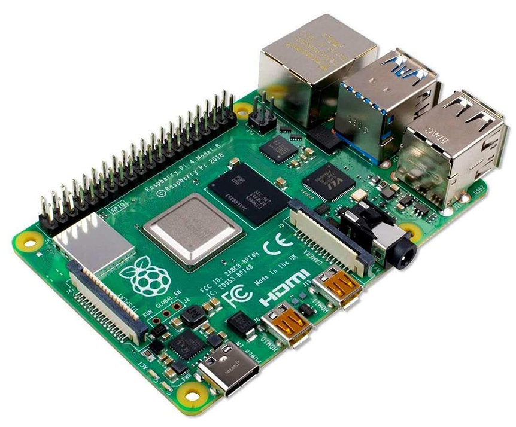

# WRO_FE_Team_Glitch_2026
## Table of Contents
## Our Team: Overview
## Our Robot
### Electronics Used:
|Part Name|Use in Our Robot|Image|
|-|-|-|
|**Microcontrollers**| | |
|Raspberry Pi 4B|Primary processer - processes camera and LiDAR and controls steering servo and the drive motor||
|Arduino Mega 2560|Secondary microcontroller - processes IMU and encoder data and transmits it to the RasPi|IMAGE HERE|
|**Sensors**| | |
|HikVision USB Webcam|Camera that senses the game elements' position and colour to avoid them and choose the correct path|IMAGE HERE--------------- -------------|
|TFMini Plus LiDAR|Detects distance from sides of the robot to the field walls|IMAGE HERE-----------------------------|
|RPLiDAR C1|360° LiDAR mounted at front of the robot to detect distance from traffic signs|IMAGE HERE -------------------|
|BNO085x IMU|9DOF IMU (XYZ, YPR) used for localization to find the robot's position on the field|IMAGE HERE -------|
|**Power**|
|11.1V Li-ion Battery|Rechargable battery that powers the whole robot|IMAGEAGEAGEAGEAGEAGEAGEAGE|
|DC-DC Buck Converter|Reduces the 12V power to 5V for the Arduino, Raspberry Pi, and encoder|IMAGE------------|
|Arduino Mega Shield|Circuit board attached to Arduino to fasten wires using screws instead of just plugging in|IMAGE--------------------|

### 
